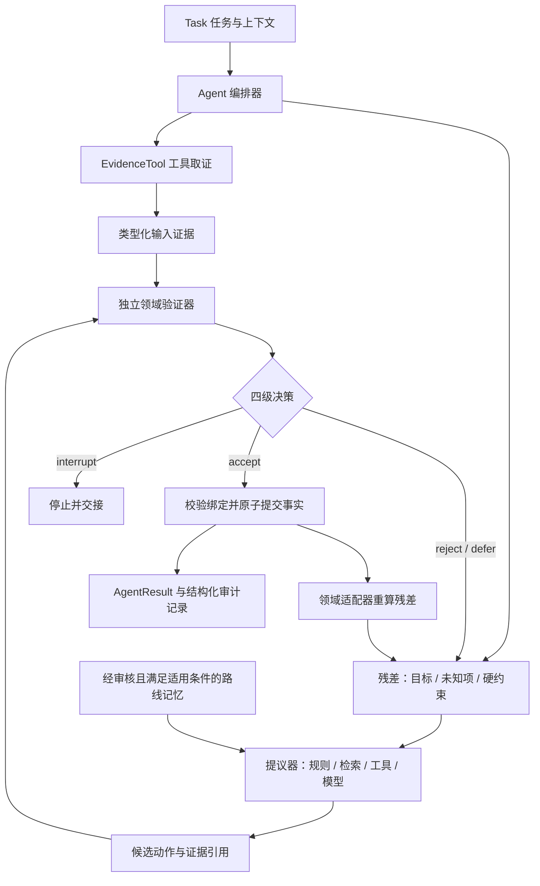

# Residual Agent

**让模型提议，让验证器决定，让残差驱动下一步。**

一个领域无关、零运行时依赖的**神经符号 Agent 架构**。把任务、工具取证、模型提议、独立验证、残差执行循环和经审路线记忆串成可运行的 Agent。来自「桥梁医生」的实践，并以独立 Python 框架重新实现。

[English](README.en.md) · [架构与信任边界](docs/architecture.md) · [扩展接口](docs/adapters.md) · [来源与范围](docs/provenance.md)

> **v0.1.0 / 实验阶段。** 这是验证门控的编排框架。领域验证器的质量决定了结论的质量；它不是任意自然语言的自动证明器。离线示例使用确定性提议器，不需要模型账号。

## Agent 架构



「残差」指当前还没有完成的义务：需要回答的目标、尚缺的信息，以及未满足的硬约束。每一步都从实际提交的事实重算残差。候选不能靠自称“已验证”或“已完成”减少残差。

验证结果绑定候选内容、状态和输入证据。正式事实只能来自验证器的输出；模型提议本身不会自动成为事实。记忆保存经过审核的动作路线，复用时仍须根据当前证据重新验证。

## 快速开始

需要 Python 3.10 或更新版本。在本仓库根目录运行：

```bash
python -m venv .venv
source .venv/bin/activate
python -m pip install -e '.[dev]'
python -m examples.agent_demo
python -m examples.inventory
python -m examples.document_review
python -m examples.route_memory
python -m pytest -q
```

Windows PowerShell 使用 `.venv\Scripts\Activate.ps1` 激活环境。运行时不依赖任何第三方包；安装工具和测试工具可能需要下载。也可以跳过安装，用 `PYTHONPATH=src python -m examples.inventory` 运行示例（POSIX shell）。

完整示例会让“模型”先提出错误库存 `999`，被独立验证器拒绝；下一次提出 `12`，验证器用工具证据重算通过，残差清空。拒绝原因会反馈给下一轮模型提议。模型回调是离线模拟，可替换成你自己的模型 SDK。

```python
from examples.agent_demo import build_agent
from residual_agent import Task

agent = build_agent()
result = agent.run(Task("demo", "核对本批次库存", "inventory"))
print(result.run_result.status)  # solved
print(result.to_json())         # 工具、证据、候选、决策与未决项
```

## 可以看到什么

| 示例 | 提议与验证 | 残差的作用 |
| --- | --- | --- |
| 完整 Agent | 任务 → 工具 → 模型回调 → 验证 → 已核验结果 | 错误提议被拒绝后继续执行 |
| 库存计算 | 从合成库存证据重新计算，拒绝错误候选 | 只有结果核验通过才能完成目标 |
| 资料完整性 | 核对同一对象、同一范围的所需资料 | 缺资料保留未知项，不伪造完整结论 |
| 路线记忆 | 待审不可检索，审核后可提示动作，撤销后不可用 | 路线只指导步骤，当前事实重新计算 |

## 扩展到自己的领域

由 `Agent` 装配 `Task`、`EvidenceTool`、可选 `RouteMemory`，并为任务创建三个扩展接口：

1. `Proposer.propose(...)`：根据已提交状态和残差提出候选。可以接模型、规则或检索服务。
2. `Verifier.verify(...)`：独立核对证据、对象、单位、适用范围和领域规则，返回四级决策及可提交事实。
3. `Domain.rebuild(...)`：从实际事实重建未完成义务，决定是否完成。

从 [agent_demo.py](examples/agent_demo.py) 的完整 Agent 开始，再看 [inventory.py](examples/inventory.py) 的领域验证实现，然后阅读 [适配器指南](docs/adapters.md)。模型适配器只是候选生产者；不要把模型自报的正确性当成验证结果。

## 已实现与边界

- `Agent.run(Task)` 任务编排、注册工具取证、可注入模型回调和结构化结果。
- 不可变数据契约、证据引用检查、验证绑定、冲突检查和事务提交。
- `accept / reject / defer / interrupt`、轮换提议器、尝试次数与无进展停止策略。
- JSON 运行记录和明确的停止原因。
- 进程内路线记忆，带适用条件、审核记录和撤销。

工具在任务开始时采集证据；循环内动态取证、自动多角色规划尚未实现。

不包含模型权重、托管推理、任意代码执行、CAS 证明、自动知识蒸馏、持久化数据库或分布式运行。没有 token、工具费用或强制墙钟限时保障；阻塞的回调须由调用方设置超时与进程隔离。哈希绑定用于发现串用结果，不能认证恶意验证器。

本仓库仅包含通用实现和合成示例，不包含原应用的业务档案、客户数据、账号凭据、模型运行日志或比赛材料。原始输入的真实性仍需由接入方保证。详细限制见 [架构说明](docs/architecture.md)。

## 贡献与许可

欢迎增加新的领域适配器与验证失败测试，见 [CONTRIBUTING.md](CONTRIBUTING.md)。本项目采用 [MIT License](LICENSE)。
