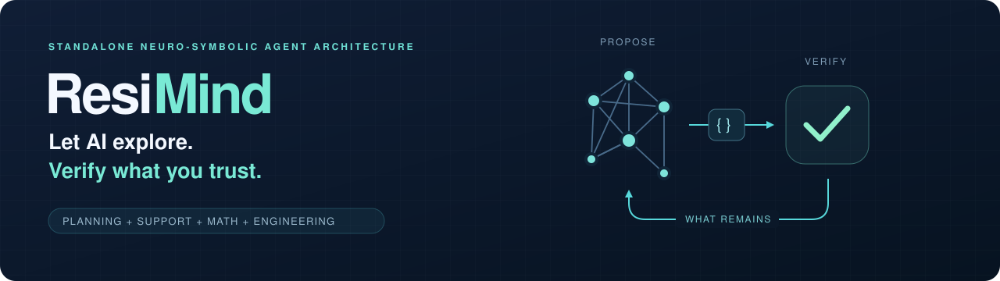
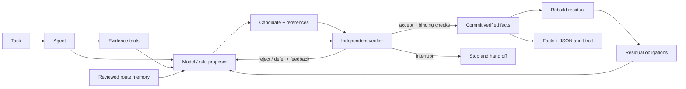

# ResiMind

**Models propose. Verifiers decide. Residuals drive the next step.**

A lightweight **neuro-symbolic Agent architecture for mathematics, engineering, and other structured tasks**. Models suggest steps; domain verifiers check certificates and physical equations; residuals keep unfinished obligations visible.

**Python 3.10+ · Zero runtime dependencies · MIT · Experimental v0.4.0**

[中文](README.zh-CN.md) · [Mathematical proof case](docs/constrained-optimization.md) · [Continuous bridge case](docs/continuous-bridge.md) · [How it is neuro-symbolic](docs/neuro-symbolic.md) · [Architecture](docs/architecture.md)

**Project creator and original publisher: [@1105216375-alt](https://github.com/1105216375-alt).** [Original repository](https://github.com/1105216375-alt/resimind) · [Citation](CITATION.cff)

## Mathematics: a solution is not yet a proof

Minimize a three-variable quadratic with coupled terms, an equality constraint, nonnegativity, and an upper bound:

$$
\min_x\;2x_1^2+x_1x_2+x_2^2+x_3^2-8x_1-3x_2-3x_3,
\quad x_1+x_2+x_3=3,\quad x\geq0,\quad x_1\leq1.
$$


The initial equality-stationary proposal is **(26/15, 1/5, 16/15)**. Its objective is lower, but it violates `x1 <= 1`: the verifier rejects it. After feedback, the Agent proposes **(1, 3/4, 5/4)** with objective **−73/8**.

That answer alone cannot close the task. The verifier must check exact **LDLᵀ positive-definiteness, primal feasibility, KKT stationarity and complementarity, and a polynomial global-optimality certificate**. All arithmetic uses rational numbers. The offline proposer searches active sets; the verifier checks the submitted certificate without running that search.

```bash
python -m examples.constrained_optimization
python -m examples.constrained_optimization --json
```

```text
ACCEPT certify_convexity   → positive_definiteness_verified   (2 remaining)
REJECT certify_primal_dual → primal_inequality_violation      (2 remaining)
ACCEPT certify_primal_dual → primal_and_kkt_verified          (1 remaining)
ACCEPT certify_global     → global_gap_identity_verified     (0 remaining)
```

[Read the problem, proof, and failure cases →](docs/constrained-optimization.md)

## Bridge engineering: continuity changes the answer

Analyze a synthetic **24 m + 30 m two-span continuous bridge girder** with unequal flexural stiffness, dead load, left/right/both-span live loading, and two supplied load combinations: **eight cases in total**.


The first proposal treats the spans as independent simply supported beams. It can balance forces and still be wrong: the rotations at the shared pier must agree. The verifier checks the beam equations and displacement compatibility before accepting the corrected continuous-beam solution.

The Agent then has to account for every required load case, calculate support reactions and positive/negative moment extrema, form the case envelope, and compare supplied moment and **midspan-deflection** limits. Omitting a pattern leaves outstanding obligations; a checked limit exceedance remains a valid completed analysis.

```bash
python -m examples.continuous_bridge
python -m examples.continuous_bridge --json
```

| Result | Value | Governing pattern |
| --- | ---: | --- |
| Pier hogging moment | −7,281.94 kN·m | Both spans |
| Span AB sagging maximum | +3,403.57 kN·m | Left span |
| Span BC sagging maximum | +6,241.85 kN·m | Right span |

[Read the structural model, equations, and limits →](docs/continuous-bridge.md)

> Both showcases execute real checks with deterministic offline proposers and deliberate first-step mistakes. Supply a model callback to use neural proposals. These runs demonstrate verification behavior, not LLM accuracy. The bridge is a synthetic equivalent line-beam example with supplied limits, not a design-code assessment; its midpoint checks are not a global deflection envelope.

## Run both examples

```bash
git clone https://github.com/1105216375-alt/resimind.git
cd resimind
python -m venv .venv
source .venv/bin/activate
python -m pip install .
python -m examples.constrained_optimization
python -m examples.continuous_bridge
```

On Windows PowerShell, activate with `.venv\Scripts\Activate.ps1`. Examples run offline with no API key. Build tools may need downloading during installation.

Both return the same `AgentResult` and preserve evidence, decisions, facts, and unfinished obligations:

```python
from resimind.domains.optimization import run_demo as optimize
from resimind.domains.bridge import run_demo as analyze_bridge

for result in (optimize(), analyze_bridge()):
    print(result.run_result.status)
    print(result.to_json())
```

| Adapter | Independent checks | Completion requires |
| --- | --- | --- |
| [Constrained optimization](src/resimind/domains/optimization.py) | Exact factorization, feasibility, KKT, polynomial certificate | A verified global optimum certificate |
| [Continuous bridge](src/resimind/domains/bridge.py) | Equilibrium, curvature and compatibility, all load cases, moment extrema | Complete case envelopes and supplied-limit comparisons |
| [Linear equation](src/resimind/domains/mathematics.py) | Rational normalization, solving and substitution | Original-equation checks, including no-solution/identity cases |
| [Axial bar](src/resimind/domains/engineering.py) | Declared assumptions, dimensions, nominal stress and supplied limit | Verified stress and comparison |

`solved` means the declared obligations are complete. It does not automatically mean a feasible solution exists or an engineering limit is satisfied. Each adapter has a bounded scope; the shared core makes those checks explicit.

## Where the neuro-symbolic part lives

**Neural proposals.** `ModelProposer` accepts a provider-neutral `complete(prompt: str) -> str` callback. A real model can choose a registered action and propose a claim with evidence references. The domain builders accept `build_agent(problem, complete=your_complete)`. The callback receives current state, outstanding obligations, evidence, allowed actions, and the last verifier feedback; it returns a JSON candidate or `null`.

**Symbolic checks.** Trusted domain code independently recomputes results and checks references, prerequisites, scope, exact rational arithmetic, and units. The verifier creates the facts that may be committed. A model cannot grant itself verification with a confidence score or a `verified` field.

**Residual feedback.** A residual is the set of outstanding goals, unknowns, and hard constraints. It is rebuilt from committed facts. A rejection preserves state and returns its reason to the proposer; a missing prerequisite keeps the task open.

This is a **neuro-symbolic architecture with an injectable neural component**. It ships no trained weights, neural training pipeline, or external-model benchmark. It is not a general theorem prover. See the [implementation map and boundaries](docs/neuro-symbolic.md).

## The architecture



- **Evidence before claims:** registered tools collect typed inputs for each task.
- **Verification before state changes:** verdicts bind to candidate, state, and evidence; commits check references and conflicts atomically.
- **Explicit unfinished work:** goals, unknowns, and hard constraints remain visible until discharged by the domain adapter.
- **Reusable routes:** in-memory routes require review and matching applicability; reused steps still need verification on current inputs.
- **Inspectable execution:** every attempt records its decision, reason, state, and residual; attempt and stall budgets bound the loop.

## Build your own adapter

Implement three small interfaces:

| Interface | Your responsibility |
| --- | --- |
| `Proposer.propose(...)` | Suggest the next candidate using a model, rules, or retrieval |
| `Verifier.verify(...)` | Check the current inputs and candidate independently; return `accept`, `reject`, `defer`, or `interrupt` |
| `Domain.rebuild(...)` | Recompute all remaining obligations from committed facts |

Assemble them with `Agent`, `Task`, registered `EvidenceTool` objects, and optional `RouteMemory`. The core does not import either reference domain. See the [adapter guide](docs/adapters.md) and [domain contract](docs/domain-contract.md) for connecting your own calculation, simulation, rule checker, or proof tool. These detailed guides are currently in Chinese; [neuro-symbolic.md](docs/neuro-symbolic.md) provides an English implementation map.

## More examples and checks

```bash
python -m examples.agent_demo       # task → tool → model callback → verifier
python -m examples.inventory        # independent recomputation and rejection
python -m examples.document_review  # missing evidence stays unresolved
python -m examples.route_memory     # review, applicability, and revocation
python -m pip install -e '.[dev]'
python -m pytest -q
```

The [validation record](docs/validation.md) describes local checks and their scope. No external-model performance or production reliability is claimed.

## Current scope

ResiMind is an experimental, synchronous Agent framework. Tool evidence is collected **before** the loop. Dynamic tool scheduling, automatic multi-role planning, provider SDK integrations, CAS/SMT/prover connectors, learned memory, persistence, and distributed execution are not included.

Domain verifiers and residual builders are trusted application code; their correctness determines what `solved` means. Evidence labels do not authenticate real-world inputs. Digests catch result mix-ups, not malicious plugins. Callers must enforce model/tool timeouts and resource limits; step budgets cannot interrupt a blocked callback. There are no enforced token or cost budgets.

This repository contains a generic implementation and synthetic examples distilled from the Bridge Doctor application's workflow. It contains no original application records, customer data, credentials, or private model logs. Read [provenance](docs/provenance.md), [architecture and trust boundaries](docs/architecture.md), and [security](SECURITY.md).

## Authorship and citation

ResiMind was initiated and originally published by [@1105216375-alt](https://github.com/1105216375-alt), drawing on the creator's Bridge Doctor application. The original repository is [1105216375-alt/resimind](https://github.com/1105216375-alt/resimind); its [releases](https://github.com/1105216375-alt/resimind/releases) record published versions. See [provenance](docs/provenance.md) for the extraction scope.

If you use or discuss ResiMind, please cite the project and link to the original repository. Suggested citation:

> 1105216375-alt. ResiMind (version 0.4.0), 2026. https://github.com/1105216375-alt/resimind

Machine-readable citation metadata is provided in [CITATION.cff](CITATION.cff). Citation is appreciated, not an additional license condition. Commercial use is permitted under the [MIT License](LICENSE), which requires retaining its copyright and permission notices in copies or substantial portions of the software.

New domain adapters, counterexamples, and verifier failure tests are welcome. See [CONTRIBUTING.md](CONTRIBUTING.md).
