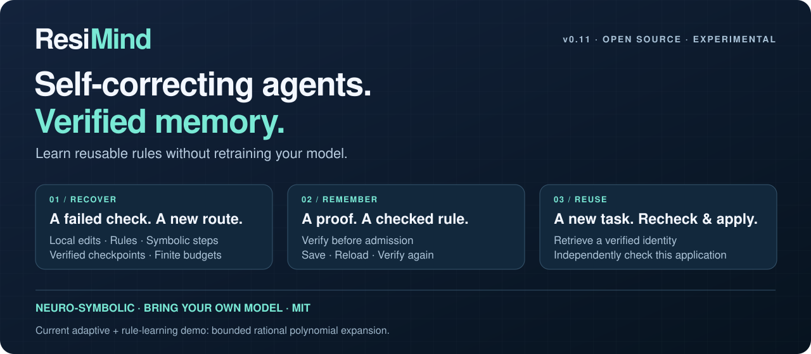
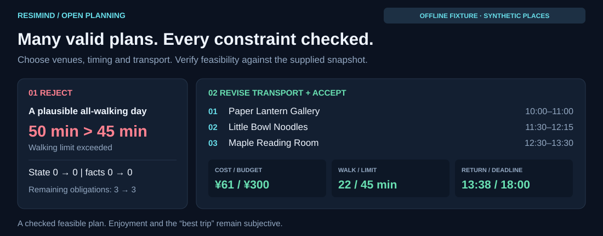
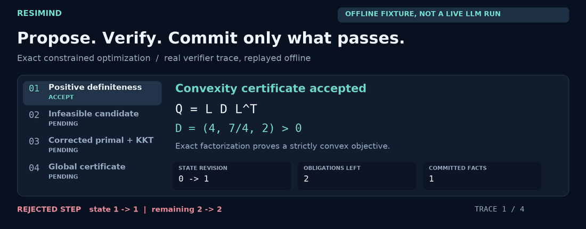
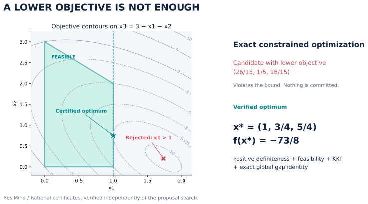
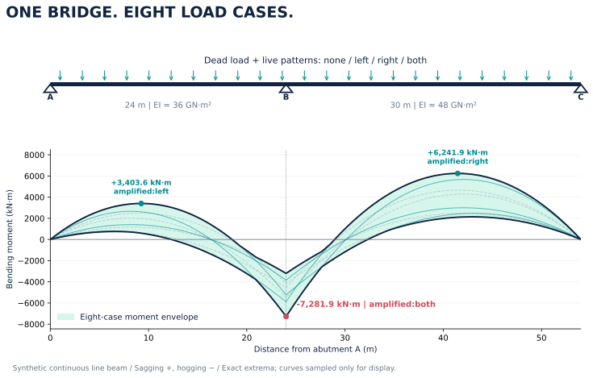
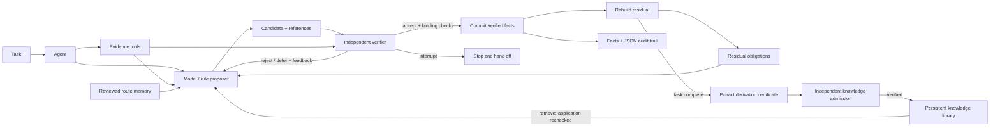

# ResiMind — Self-Correcting Agents with Verified Memory

**Catch a bad step. Try another route. Remember a verified solution.**

ResiMind is a standalone, open-source **neuro-symbolic Agent architecture** for verification-guided self-correction and reusable rule memory. Rules, symbolic tools and your model can propose steps. Independent code checks them. The **residual** tracks what remains to be solved and guides the next attempt.

**Self-correction · Verified agent memory · Knowledge growth without model retraining**

The [adaptive math Agent](docs/adaptive-reasoning.md) can switch strategies after a failed check and turn completed, verified derivations into rules for future tasks. Here, **verified memory** means a persistent rule library: verify before admission, recheck on reload, and verify each new application. Knowledge grows outside the model; its weights stay unchanged.

The current adaptive and rule-learning demo supports **bounded rational polynomial expansion**. The same Agent core also runs planning, customer support, optimization and bridge examples with domain-specific checks.

**Bring your own model · Python 3.10+ · Zero-dependency core · MIT · v0.12.1 / Experimental**

[中文](README.zh-CN.md) · [Quick start](#try-it-in-three-minutes) · [Knowledge growth](docs/knowledge-growth.md) · [Open-ended case](#open-ended-planning-many-answers-explicit-constraints) · [Evidence](#measure-the-agent-not-the-model) · [Architecture](#the-architecture)

**Created and originally published by [@1105216375-alt](https://github.com/1105216375-alt).** [Original repository](https://github.com/1105216375-alt/resimind) · [Citation](CITATION.cff)

## Watch it recover. Then watch it reuse what worked.

| Capability | What actually happens |
| --- | --- |
| **Self-correction** | A failed check can trigger a smaller local task, a verified rule, a symbolic rewrite, or a checked checkpoint return. |
| **Verified memory** | A completed proof can become a stored rule, with conditions and provenance, independently checked on admission and reload. |
| **Learning without retraining** | A new task can retrieve and execute the rule, checking its application again. Model weights stay unchanged. |

Each new candidate is checked before becoming a fact; retry and action budgets remain bounded across strategy changes.

```text
Propose → check → diagnose what remains → change strategy → check again
                                                     ↓
                                  completed proof → admit rule → reuse and recheck
```

Try the offline recovery demo: a deliberately wrong expansion is rejected, a local edit passes, symbolic steps finish the proof, and its checked rule solves a new-variable task in one application. The fixture is scripted; the verification, state transitions, rule admission and reuse actually execute.

**Current scope:** the adaptive adapter handles bounded rational polynomial expansion. Other domains share the Agent core and use their own checks. An optional Lean 4.29.0 backend checks generated equalities over `Rat` and feeds unfinished proof goals back into the next proposal.

[**Run the adaptive Agent →**](docs/adaptive-reasoning.md) · [Release validation](docs/validation-v0.12.1.md) · [Changelog](CHANGELOG.md)

### New in v0.12: let hard cases spend a bounded reserve

The adaptive math Agent keeps its normal local-work budget, then can spend an
explicit cumulative overflow reserve on unusually large symbolic steps. Each
accepted step pays only its estimated excess; exact identity, goal progress and
optional Lean gates still decide whether it commits. The default reserve is
zero, so existing callers keep the previous budget behavior.

### New in v0.11: keep reasoning aimed at the goal

A correct equality can leave the original problem unfinished. The math Agent now inspects goal progress before spending a Lean proof check: cosmetic rewrites receive concrete feedback, useful decomposition can grow the expression, and uncertain intermediate steps have a finite exploration allowance. Every committed step still needs exact verification and Lean when enabled.

[**Run cosmetic recovery and useful decomposition →**](docs/goal-progress.md)

### New in v0.10: use what you know; call the model when needed

The math adapter now compares bounded previews of verified rules, compaction and local expansion before requesting a model. A rule that closes the task can win even if its expression is larger; a matching rule can be skipped when simpler local work looks cheaper. Every selected step still needs independent verification, including Lean when enabled.

[**Try local selection, zero-callback reuse and explicit fallback →**](docs/cost-aware-scheduling.md)

### New in v0.9: compact math, with Lean in the loop

Keep intermediate expressions small with exact term collection and bounded local distribution. When Lean is enabled, each accepted step also needs a kernel-checked proof. An unfinished proof supplies the next proposal with its actual Lean goal and diagnostics; it can change tactic or rewrite, within finite budgets.

[**Run the growth comparison and real Lean feedback demos →**](docs/expression-growth-and-lean.md)

## Try it in three minutes

With Python installed:

```bash
git clone https://github.com/1105216375-alt/resimind.git
cd resimind
python -m venv .venv
source .venv/bin/activate
python -m pip install .
python -m resimind demo --domain scheduling
```

On Windows PowerShell, activate with `.venv\Scripts\Activate.ps1`. Installation may download build tools. The demo runs **offline, without an API key**; both `python -m resimind` and the installed `resimind` command work outside the checkout.

The first demo saves and reloads checked rules, then compares empty and learned libraries with a callback configured. The normal tasks should finish without invoking that callback. A separate case with a deliberately zero local-work budget invokes one scripted proposal to show fallback. No API calls are made.

Choose a different challenge. All ten commands run offline; the Lean example additionally requires an installed Lean 4.29.0 toolchain:

| Try | What the example makes visible | Command |
| --- | --- | --- |
| [Goal progress](docs/goal-progress.md) | Skip a cosmetic rewrite, act on remaining expansion goals, and allow a useful step with a larger expression | `python -m resimind demo --domain progress` |
| [Local scheduling](docs/cost-aware-scheduling.md) | Reuse a useful rule, simplify before an expensive substitution, and skip model callbacks when local work suffices | `python -m resimind demo --domain scheduling` |
| [Expression growth](docs/expression-growth-and-lean.md) | Compare primitive expansion with bounded distribution and term collection on four quadratic factors | `python -m resimind demo --domain growth-control` |
| [Lean proof feedback](docs/expression-growth-and-lean.md#let-lean-feedback-drive-the-next-proposal) | A real unfinished Lean goal drives a new tactic, then a checked rule is reused | `python -m resimind demo --domain lean` |
| [Adaptive reasoning](docs/adaptive-reasoning.md) | Reject a wrong step, change strategy, finish a proof and reuse its checked rule | `python -m resimind demo --domain adaptive` |
| [Knowledge growth](docs/knowledge-growth.md) | Derive a rule, verify and store it, then reuse and recheck it on a new task | `python -m resimind demo --domain knowledge-growth` |
| [Open-ended planning](docs/open-planning.md) | Many valid answers; time, budget, and route constraints still apply | `python -m resimind demo --domain planning` |
| [Customer support](docs/customer-support.md) | A ¥259 refund proposal fails the configured ¥249 calculation | `python -m resimind demo --domain customer-support` |
| [Mathematics](docs/constrained-optimization.md) | A lower objective is useless if the candidate violates a constraint; check an exact optimality certificate | `python -m resimind demo` |
| [Bridge engineering](docs/continuous-bridge.md) | Balanced forces can still hide incompatible rotations at a shared pier | `python -m resimind demo --domain bridge` |

Add `--json` to inspect the audit. [Connect DeepSeek](docs/open-planning.md#let-deepseek-choose-the-plan) when you want the model to compose its own plan.

## Derive once. Reuse on a new task.

An Agent derives the square and cube identities, submits their proof chains for independent admission, saves its library, and reloads it with verification. New tasks can retrieve those rules; each application must still pass the current task's checks.

| Ten-task offline comparison | Fixed library | Growing library |
| --- | ---: | ---: |
| Independently valid completed tasks | 10/10 | 10/10 |
| Transfer proposals | 84 | **24** |
| Committed cross-task rule applications | 0 | **8** |

**71.4% fewer transfer proposals**, with **13 additional proposals to learn the rules**. Both arms use the same deterministic proposer and budget. This measures reuse on published development tasks; it does not measure a model accuracy gain or total compute savings.

[**How rules are proved, admitted, stored, revoked, and reused →**](docs/knowledge-growth.md) · [Reproduce the comparison](benchmarks/knowledge_growth.py) · [Validation](docs/validation-knowledge-growth.md)

## Earlier published pilot: same DeepSeek, four Agent strategies

These v1/v2 records describe earlier implementations; they are not a benchmark of the v0.8 adaptive adapter.

The original frozen, eight-task algebra pilot (v1) uses **`deepseek-flash`**, identical model settings, and an **eight-call ceiling per task**. A separate exact oracle scores final outputs.

| Agent strategy | Valid completed tasks | Invalid answers delivered | Transfer model calls |
| --- | ---: | ---: | ---: |
| ReAct-style baseline | 5/8 | 3 | 8 |
| Verify and retry | 6/8 | 0 | 22 |
| Residual reasoning | 6/8 | 0 | 22 |
| **Residual + verified knowledge growth** | **7/8** | **0** | **20** |

The growth arm records **3 actual cross-task rule applications**, all on tasks the other arms also solve. Its extra completed task has no committed rule application, so the 7/8 result does not isolate a causal benefit from reuse. Learning its three rules costs **3 additional calls**, bringing learning plus transfer to **23 calls**. This run does not establish overall cost savings.

This is a single, handcrafted pilot. The ReAct-style implementation offered an optional check tool, but the model chose no tool calls. The study measures these four implementations under the published protocol; it is not a ranking against optimized ReAct systems or evidence of general superiority.

**Earlier development rerun: more informative feedback, same eight cases.** After inspecting v1, we added exact coefficient-discrepancy feedback and reran the seen tasks:

| Agent strategy | Correct in development v2 | Transfer calls |
| --- | ---: | ---: |
| ReAct-style baseline | 5/8 | 8 |
| Verify and retry | **7/8** | **17** |
| Residual reasoning | 6/8 | 22 |
| Residual + verified knowledge growth | **7/8** | 20 |

All three gated arms again deliver no invalid answer. Growth still needs 3 discovery calls and records 3 cross-task rule applications: **it ties verify-and-retry on completion and uses more calls**. The updated feedback did not improve residual or growth completion in this rerun. This is post-result development on seen cases, not a fresh held-out result; v1 remains available unchanged.

[**Protocol, per-task results, tokens, and limitations →**](docs/algebra-live-evaluation.md) · [v1 JSON](docs/evidence/algebra-live-v1/summary.json) · [Development v2 JSON](docs/evidence/algebra-feedback-v2/summary.json)

## Open-ended planning: many answers, explicit constraints

**The request:** “Plan a relaxed day with art and a meal. I like quiet places and coffee.”

The supplied hard constraints are **09:00–18:00, ¥300 for one person, at most 45 minutes walking, at least three distinct stops, art and a meal, and a return to the starting station**. Opening windows, minimum visit durations, and every travel leg must also fit. Quietness and coffee begin as preferences; the later experiment makes coffee mandatory.

### Same request, different valid answers

The model can choose places, order, timing, and transport. The verifier accepts a whole plan that satisfies the constraints, without comparing it to one fixed answer. These two independently checked offline examples satisfy the same original request:

| Feasible plan | Cost | Walking | Return |
| --- | ---: | ---: | --- |
| Gallery → noodles → reading room | ¥61 | 22 min | 13:38 |
| Cafe → pottery workshop → reading room | ¥95 | 8 min | 13:43 |

Venue and transport data are fictional. These checks establish feasibility under the supplied inputs; enjoyment and the “best day” remain subjective. [Inspect the schedules and transport choices](docs/open-planning.md#try-the-three-scenarios).

### A constraint fails: inspect the feedback and revision



| Offline scenario | What happens |
| --- | --- |
| Too much walking | Reject **50 minutes > 45 minutes** without changing committed facts; revised transport reduces walking to **22 minutes**, and the plan passes. |
| Rain requires indoor venues | Reject the garden visit; a revised indoor itinerary passes. |
| Return-route measurements are missing | Keep the transport evidence unresolved; no verified itinerary is produced. |

These are executable **offline fixtures**, with deliberately flawed candidates. The checks and state transitions really execute; these mistakes are not attributed to a live model.

**The neuro-symbolic interaction:** neural proposals explore the choices, symbolic checks enforce the explicit constraints, and residual feedback tells the next proposal what still needs fixing or evidence.

### Change the requirement. Watch the plan change.

A real DeepSeek run proposed **gallery → noodles → reading room**. It satisfied the original constraints. We then made **coffee mandatory** in the structured requirements and resubmitted that actual plan:

| Step | What happened |
| --- | --- |
| Recheck the old plan | **Rejected:** a required activity was missing. No facts committed. |
| Give the feedback to DeepSeek | **One new model call** chose gallery → reading room → cafe. |
| Independently check the revision | **Accepted:** ¥73, 35 minutes walking, return at 13:04; all supplied hard constraints passed. |

The model chooses among possible plans; the verifier enforces the requirements. The cafe covers both a meal and coffee in the fictional catalog. This recorded experiment uses synthetic venue and transport data; the check establishes feasibility under those inputs.

[**Inspect both proposals, the rejection, and the checked revision →**](docs/evidence/open-planning/README.md)

[**Full planning rules and all three offline scenarios**](docs/open-planning.md) · [**Runnable example**](examples/open_planning.py) · [**Real DeepSeek audits**](docs/evidence/open-planning/README.md)

## Use the standalone Agent

ResiMind owns the reasoning loop: collect evidence, propose, verify, commit facts, and rebuild remaining obligations. Run it directly:

```python
from resimind import Task
from resimind.domains.planning import DOMAIN, build_agent, demo_problem, verified_plan

agent = build_agent(demo_problem())  # Offline; inject complete=your_model for neural proposals.
result = agent.run(Task("day-out", "Plan a relaxed day with art and a meal.", DOMAIN))
run = result.run_result
if run.status == "solved" and run.residual.solved:
    print(verified_plan(result))
else:
    print("Still unresolved:", run.residual.pending)
```

Model SDKs and external workflow connectors are [optional integrations](#optional-integrations). No LangGraph installation is needed for this Agent or the built-in domain demos.

## Customer support: check a refund before promising one

A customer asks to return an order. The recorded item payment is **¥249**, with **¥10 shipping**. Under the example merchant's configured policy, shipping is excluded from this quote.

| Situation | What the Agent does |
| --- | --- |
| Candidate proposes **¥259** | Rejects the amount; the incorrect proposal changes no committed facts. |
| Corrected candidate proposes **¥249** | Verifies eligibility and amount, then produces a structured recommendation. |
| Delivery date is missing | Keeps the required evidence pending; no completed refund recommendation. |
| Request is outside the configured window | Recommends human review; does not invent a policy exception. |

```bash
python -m resimind demo --domain customer-support
python -m resimind demo --domain customer-support --scenario missing-delivery
python -m resimind demo --domain customer-support --scenario expired
```

These are offline demonstrations using fictional merchant rules and synthetic orders. The Agent prepares a recommendation; it does not execute a refund or claim that money has arrived. A missing-evidence run exits nonzero because the task is still open. You can also connect a real DeepSeek callback.

[Read the customer-support adapter and live example →](docs/customer-support.md) · [Actual DeepSeek run: 5 calls, 2 rejected proposals, verified recommendation](docs/evidence/customer-support/README.md)

## Mathematics: a solution is not yet a proof

**Learn a reusable step from a completed proof:** the new [knowledge-growth Agent](docs/knowledge-growth.md) adds a second loop: verified derivation → candidate rule → independent admission → persistent library → future proposals. Its polynomial demo uses a deterministic rewrite grammar; a model callback can supply proposals through the same gate. Recorded results measure offline rule reuse, not neural mathematical discovery.



[Static trace](docs/assets/verification-demo.png). This is an executed offline fixture with a deliberately infeasible candidate.

Minimize a three-variable quadratic with coupled terms, an equality constraint, nonnegativity, and an upper bound:

$$
\min_x\;2x_1^2+x_1x_2+x_2^2+x_3^2-8x_1-3x_2-3x_3,
\quad x_1+x_2+x_3=3,\quad x\geq0,\quad x_1\leq1.
$$



The initial equality-stationary proposal is **(26/15, 1/5, 16/15)**. Its objective is lower, but it violates `x1 <= 1`: the verifier rejects it. After feedback, the Agent proposes **(1, 3/4, 5/4)** with objective **−73/8**.

That answer alone cannot close the task. The verifier must check exact **LDLᵀ positive-definiteness, primal feasibility, KKT stationarity and complementarity, and a polynomial global-optimality certificate**. All arithmetic uses rational numbers. The offline proposer searches active sets; the verifier checks the submitted certificate without running that search.

```bash
python -m examples.constrained_optimization
python -m examples.constrained_optimization --json
```

```text
ACCEPT certify_convexity   → positive_definiteness_verified   (2 remaining)
REJECT certify_primal_dual → primal_inequality_violation      (2 remaining)
ACCEPT certify_primal_dual → primal_and_kkt_verified          (1 remaining)
ACCEPT certify_global     → global_gap_identity_verified     (0 remaining)
```

[Read the problem, proof, and failure cases →](docs/constrained-optimization.md)

## Bridge engineering: continuity changes the answer

Analyze a synthetic **24 m + 30 m two-span continuous bridge girder** with unequal flexural stiffness, dead load, left/right/both-span live loading, and two supplied load combinations: **eight cases in total**.



The first proposal treats the spans as independent simply supported beams. It can balance forces and still be wrong: the rotations at the shared pier must agree. The verifier checks the beam equations and displacement compatibility before accepting the corrected continuous-beam solution.

The Agent then has to account for every required load case, calculate support reactions and positive/negative moment extrema, form the case envelope, and compare supplied moment and **midspan-deflection** limits. Omitting a pattern leaves outstanding obligations; a checked limit exceedance remains a valid completed analysis.

```bash
python -m examples.continuous_bridge
python -m examples.continuous_bridge --json
```

| Result | Value | Governing pattern |
| --- | ---: | --- |
| Pier hogging moment | −7,281.94 kN·m | Both spans |
| Span AB sagging maximum | +3,403.57 kN·m | Left span |
| Span BC sagging maximum | +6,241.85 kN·m | Right span |

[Read the structural model, equations, and limits →](docs/continuous-bridge.md)

> Both showcases execute real checks with deterministic offline proposers and deliberately invalid candidates. Supply a model callback to use neural proposals. These runs demonstrate verification behavior, not LLM accuracy. The bridge is a synthetic equivalent line-beam example with supplied limits, not a design-code assessment; its midpoint checks are not a global deflection envelope.

## Included domain adapters

| Adapter | Independent checks | Completion requires |
| --- | --- | --- |
| [Knowledge growth](src/resimind/domains/polynomial_learning.py) | Exact polynomial proof chains, independent admission, reload and application checks | A completed task before rule extraction; unknown checks cannot admit knowledge |
| [Open-ended planning](src/resimind/domains/planning.py) | Budget, time windows, route continuity, visit coverage, walking and indoor requirements | Any feasible itinerary with grounded transport; subjective preferences stay unverified |
| [Customer support](src/resimind/domains/customer_support.py) | Scoped order evidence, configured policy, exact refund arithmetic | A checked recommendation or human-review outcome; missing evidence stays open |
| [Constrained optimization](src/resimind/domains/optimization.py) | Exact factorization, feasibility, KKT, polynomial certificate | A verified global optimum certificate |
| [Continuous bridge](src/resimind/domains/bridge.py) | Equilibrium, curvature and compatibility, all load cases, moment extrema | Complete case envelopes and supplied-limit comparisons |
| [Linear equation](src/resimind/domains/mathematics.py) | Rational normalization, solving and substitution | Original-equation checks, including no-solution/identity cases |
| [Axial bar](src/resimind/domains/engineering.py) | Declared assumptions, dimensions, nominal stress and supplied limit | Verified stress and comparison |

`solved` means the declared obligations are complete. It does not automatically mean a feasible solution exists or an engineering limit is satisfied. Each adapter has a bounded scope; the shared core makes those checks explicit.

## Where the neuro-symbolic part lives

**Neural proposals.** `ModelProposer` accepts a provider-neutral `complete(prompt: str) -> str` callback. A real model can choose a registered action and propose a claim with evidence references. The domain builders accept `build_agent(problem, complete=your_complete)`. The callback receives current state, outstanding obligations, evidence, allowed actions, and the last verifier feedback; it returns a JSON candidate or `null`.

**Symbolic checks.** Trusted domain code independently recomputes results and checks references, prerequisites, scope, exact rational arithmetic, and units. The verifier creates the facts that may be committed. A model cannot grant itself verification with a confidence score or a `verified` field.

**Residual feedback.** A residual is the set of outstanding goals, unknowns, and hard constraints. It is rebuilt from committed facts. A rejection preserves state and returns its reason to the proposer; a missing prerequisite keeps the task open.

**Knowledge growth.** `LearningAgent` extracts candidate knowledge from completed derivations. `KnowledgeLibrary` delegates admission to the registered domain verifier, supports save/reload with re-verification and revocation, and retrieves rules as proposal guidance. Current-task verification still applies.

Models connect through callbacks; the project develops **Agent reasoning, verification, and knowledge admission**. The algebra proof checker has explicit expression and resource limits. See [knowledge growth](docs/knowledge-growth.md) and the [neuro-symbolic implementation map](docs/neuro-symbolic.md).

## The architecture



- **Evidence before claims:** registered tools collect typed inputs for each task.
- **Verification before state changes:** verdicts bind to candidate, state, and evidence; commits check references and conflicts atomically.
- **Explicit unfinished work:** goals, unknowns, and hard constraints remain visible until discharged by the domain adapter.
- **Knowledge that carries forward:** completed derivations face independent admission, re-verification on reload, and checks on every new application.
- **Reusable routes:** in-memory routes require review and matching applicability; reused steps still need verification on current inputs.
- **Inspectable execution:** every attempt records its decision, reason, state, and residual; attempt and stall budgets bound the loop.

## Build your own adapter

Implement three small interfaces:

| Interface | Your responsibility |
| --- | --- |
| `Proposer.propose(...)` | Suggest the next candidate using a model, rules, or retrieval |
| `Verifier.verify(...)` | Check the current inputs and candidate independently; return `accept`, `reject`, `defer`, or `interrupt` |
| `Domain.rebuild(...)` | Recompute all remaining obligations from committed facts |

Assemble them with `Agent`, `Task`, registered `EvidenceTool` objects, and optional `RouteMemory`. The core does not import either reference domain. See the [adapter guide](docs/adapters.md) and [domain contract](docs/domain-contract.md) for connecting your own calculation, simulation, rule checker, or proof tool. These detailed guides are currently in Chinese; [neuro-symbolic.md](docs/neuro-symbolic.md) provides an English implementation map.

## Optional integrations

The standalone ResiMind Agent remains responsible for proposal, verification, and residual feedback. Add only the integration your application needs:

| Integration | Purpose | Extra |
| --- | --- | --- |
| [DeepSeek](docs/live-model.md) | Supply real neural proposals to any domain builder. | `.[deepseek]` |
| [OpenAI Responses](docs/live-model.md#optional-openai-responses-path) | Use an alternative model callback. | `.[openai]` |
| [LangGraph](docs/langgraph.md) | Call ResiMind from an existing graph and route completed or unresolved results. | `.[langgraph]` |

For live planning, run from a checkout:

```bash
python -m pip install '.[deepseek]'
# Set DEEPSEEK_API_KEY and DEEPSEEK_MODEL in your local environment first.
python -m examples.open_planning --live --json
```

Live calls can incur provider charges and can remain unresolved. The model guide documents request budgets and timeouts; there is no offline fallback after a failed live request. [Validation](docs/validation.md) distinguishes actual live records from simulated transport tests.

**LangGraph is an optional outer connector.** The ResiMind core and all domain adapters run without it. Use its [verification subgraph](docs/langgraph.md) when integrating with an existing LangGraph project; it forwards checked facts or unresolved obligations and does not supply additional domain verification rules.

## More examples and checks

```bash
python -m examples.agent_demo       # task → tool → model callback → verifier
python -m examples.inventory        # independent recomputation and rejection
python -m examples.document_review  # missing evidence stays unresolved
python -m examples.route_memory     # review, applicability, and revocation
python -m pip install -e '.[dev]'
python -m pytest -q
```

See [v0.12.1 release validation](docs/validation-v0.12.1.md) for current checks, and the [v0.12.0 record](docs/validation-v0.12.0.md), [v0.11.0 record](docs/validation-v0.11.0.md), [v0.10.0 record](docs/validation-v0.10.0.md), [v0.9.0 record](docs/validation-v0.9.0.md), [v0.8.0 record](docs/validation-v0.8.0.md), [knowledge-growth development record](docs/validation-knowledge-growth.md) and [earlier version record](docs/validation.md) for historical checks.

## Measure the Agent, not the model

Keep the model, tasks, and resource ceilings fixed; measure completion, invalid deliveries, calls, and cross-task reuse. These studies use different tasks and budgets, so their results are reported separately:

| Study | Measured result | Evidence |
| --- | --- | --- |
| Offline unified development fixtures (no model) | 150/150 independently scored completions; rule reuse reduces mean math steps by 33.1%; hard-expression reserve ablation: 2/8 → 5/8 | [Protocol, limitations and reproduction](docs/unified-benchmark-v1.md) |
| Same-model algebra: frozen v1 + seen-case development v2 | v1: 5/8, 6/8, 6/8, 7/8. v2: 5/8, 7/8, 6/8, 7/8; growth ties retry with more calls | [Four-arm protocol and results](docs/algebra-live-evaluation.md) |
| Knowledge growth: 10 offline transfer tasks | Both arms 10/10; proposals 84→24, plus 13 learning proposals; 8 committed cross-task applications | [Method and results](docs/knowledge-growth.md) |
| ChinaTravel: 12 official tasks, same DeepSeek | Official ReAct 0/12, official NeSy 5/12, ReAct + ResiMind 1/12; ResiMind delivered no invalid plan and left 11 tasks unfinished | [Full evaluation](docs/evidence/chinatravel-pilot-v1/README.md) |
| Local repair and bounded search: seen-task replay | Conservative default 0/2; explicit manual semantic annotations enable 1/2 | [Development results](docs/search-development.zh-CN.md) |
| Open-ended planning: a real requirement change | Making coffee mandatory rejects the old plan; one new DeepSeek call produces a checked revision | [Proposals and audit](docs/evidence/open-planning/README.md) |

[Related systems (中文)](docs/public-systems-comparison.zh-CN.md) compares the project with orchestration frameworks, verifier-driven reasoning, and knowledge-accumulating agents.

## Current scope

ResiMind is an experimental, synchronous Agent framework. Tool evidence is collected **before** the loop. It includes optional DeepSeek/OpenAI callbacks, a LangGraph verification subgraph, bounded search, and an independently checked knowledge library with JSON persistence. The bounded algebra adapter implements the derivation-to-reuse learning loop. Dynamic tool scheduling, automatic multi-role planning, general CAS/SMT/prover connectors, and distributed execution are not included.

Domain verifiers and residual builders are trusted application code; their correctness determines what `solved` means. Evidence labels do not authenticate real-world inputs. Digests catch result mix-ups, not malicious plugins. Callers must enforce model/tool timeouts and resource limits; step budgets cannot interrupt a blocked callback. The optional model wrappers bound response tokens and API attempts; these are not a total-cost cap or a hard deadline for the full run.

This repository contains a generic implementation and synthetic examples distilled from the Bridge Doctor application's workflow. It contains no original application records, customer data, credentials, or private model logs. Read [provenance](docs/provenance.md), [architecture and trust boundaries](docs/architecture.md), and [security](SECURITY.md).

## Authorship and citation

ResiMind was initiated and originally published by [@1105216375-alt](https://github.com/1105216375-alt), drawing on the creator's Bridge Doctor application. The original repository is [1105216375-alt/resimind](https://github.com/1105216375-alt/resimind); its [releases](https://github.com/1105216375-alt/resimind/releases) record published versions. See [provenance](docs/provenance.md) for the extraction scope.

If you use or discuss ResiMind, please cite the project and link to the original repository. Suggested citation:

> 1105216375-alt. ResiMind (version 0.12.1), 2026. https://github.com/1105216375-alt/resimind

Machine-readable citation metadata is provided in [CITATION.cff](CITATION.cff). Citation is appreciated, not an additional license condition. Commercial use is permitted under the [MIT License](LICENSE), which requires retaining its copyright and permission notices in copies or substantial portions of the software.

New domain adapters, counterexamples, and verifier failure tests are welcome. See [CONTRIBUTING.md](CONTRIBUTING.md).
