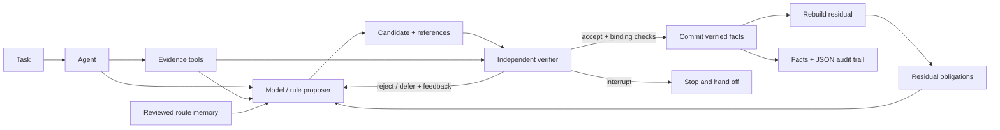

# ResiMind

**Models propose. Verifiers decide. Residuals drive the next step.**

A lightweight **neuro-symbolic Agent architecture for mathematics, engineering, and other structured tasks**. Give a model room to propose. Check its work with explicit domain rules. Turn rejected claims and unfinished obligations into the next reasoning step.

**Python 3.10+ · Zero runtime dependencies · MIT · Experimental v0.3.0**

[中文](README.zh-CN.md) · [How it is neuro-symbolic](docs/neuro-symbolic.md) · [Architecture](docs/architecture.md) · [Domain adapters](docs/domain-contract.md) · [Contributing](CONTRIBUTING.md)

## Try the loop

Clone the repository and run the included examples (or skip the first two lines if you have already downloaded it):

```bash
git clone https://github.com/1105216375-alt/resimind.git
cd resimind
python -m venv .venv
source .venv/bin/activate
python -m pip install .
python -m examples.mathematics_agent
python -m examples.engineering_agent
```

On Windows PowerShell, activate with `.venv\Scripts\Activate.ps1`. The examples run offline with no API key. Build tools may need downloading during installation.

The math demo solves `(3/2)*x - 1/3 = 5/3`. This short script prints its actual decision trace:

```python
from resimind.domains.mathematics import run_demo

result = run_demo()
for event in result.run_result.trace:
    print(event.decision.value, event.candidate.claim, event.reasons[0])
```

```text
accept 3/2*x=2 normalization_verified
reject x=7/3 solution_claim_mismatch
accept x=4/3 solution_verified
accept substitution:5/3=5/3 original_equation_checked
```

The wrong answer never enters the fact store. Its rejection reason reaches the next proposal. Even after `x=4/3` is accepted, the task stays open until substitution into the original equation is checked.

The engineering demo computes **100 MPa** from **100 kN / 1,000 mm²**, rejects an intentionally wrong first proposal, and compares the verified stress with a supplied **150 MPa** limit. Its model assumptions, values, and limit are synthetic inputs.

> These demonstrations use deterministic offline proposers, including a fake model callback. They exercise the real verification and feedback loop; they are not evidence of LLM accuracy. Supply your own model callback for neural proposal generation.

## One Agent, different disciplines

```python
from resimind import Task
from resimind.domains.mathematics import LinearEquation, build_agent

agent = build_agent(LinearEquation("3/2", "-1/3", "5/3"))
result = agent.run(Task("equation-1", "Solve and check the equation.", "mathematics"))
print(result.run_result.status)  # solved
print(result.to_json())         # facts, evidence, residuals, and every decision
```

The engineering adapter uses the same task and result contracts:

```python
from resimind import Task
from resimind.domains.engineering import AxialBarProblem, build_agent

agent = build_agent(AxialBarProblem(
    force_value=100, force_unit="kN",
    area_value=1000, area_unit="mm2",
    allowable_stress_value=150, allowable_stress_unit="MPa",
    axial_static=True, is_uniform=True, no_local_effects=True,
))
result = agent.run(Task("bar-1", "Calculate stress and compare the limit.", "engineering"))
print(result.run_result.status)  # solved
print(result.to_json())
```

| Reference adapter | Independently checked | Completion requires |
| --- | --- | --- |
| [Mathematics](src/resimind/domains/mathematics.py) | Exact rational normalization, solution, and substitution; no-solution and identity cases | All derivation and original-equation checks |
| [Engineering](src/resimind/domains/engineering.py) | Input scope, declared model assumptions, dimensions, nominal stress `F/A`, and supplied limit | Verified stress and limit comparison |

`solved` means the declared verification obligations are complete. A verified outcome can be **“no solution”** or **“limit exceeded.”** These are narrow, runnable reference adapters; broader mathematics and engineering require additional domain implementations.

## Where the neuro-symbolic part lives

**Neural proposals.** `ModelProposer` accepts a provider-neutral `complete(prompt: str) -> str` callback. A real model can choose a registered action and propose a claim with evidence references. Both domain builders accept `build_agent(problem, complete=your_complete)`. The callback receives current state, outstanding obligations, evidence, allowed actions, and the last verifier feedback; it returns a JSON candidate or `null`.

**Symbolic checks.** Trusted domain code independently recomputes results and checks references, prerequisites, scope, exact rational arithmetic, and units. The verifier creates the facts that may be committed. A model cannot grant itself verification with a confidence score or a `verified` field.

**Residual feedback.** A residual is the set of outstanding goals, unknowns, and hard constraints. It is rebuilt from committed facts. A rejection preserves state and returns its reason to the proposer; a missing prerequisite keeps the task open.

This is a **neuro-symbolic architecture with an injectable neural component**. It ships no trained weights, neural training pipeline, or external-model benchmark. It is not a general theorem prover. See the [implementation map and boundaries](docs/neuro-symbolic.md).

## The architecture



- **Evidence before claims:** registered tools collect typed inputs for each task.
- **Verification before state changes:** verdicts bind to candidate, state, and evidence; commits check references and conflicts atomically.
- **Explicit unfinished work:** goals, unknowns, and hard constraints remain visible until discharged by the domain adapter.
- **Reusable routes:** in-memory routes require review and matching applicability; reused steps still need verification on current inputs.
- **Inspectable execution:** every attempt records its decision, reason, state, and residual; attempt and stall budgets bound the loop.

## Build your own adapter

Implement three small interfaces:

| Interface | Your responsibility |
| --- | --- |
| `Proposer.propose(...)` | Suggest the next candidate using a model, rules, or retrieval |
| `Verifier.verify(...)` | Check the current inputs and candidate independently; return `accept`, `reject`, `defer`, or `interrupt` |
| `Domain.rebuild(...)` | Recompute all remaining obligations from committed facts |

Assemble them with `Agent`, `Task`, registered `EvidenceTool` objects, and optional `RouteMemory`. The core does not import either reference domain. See the [adapter guide](docs/adapters.md) and [domain contract](docs/domain-contract.md) for connecting your own calculation, simulation, rule checker, or proof tool. These detailed guides are currently in Chinese; [neuro-symbolic.md](docs/neuro-symbolic.md) provides an English implementation map.

## More examples and checks

```bash
python -m examples.agent_demo       # task → tool → model callback → verifier
python -m examples.inventory        # independent recomputation and rejection
python -m examples.document_review  # missing evidence stays unresolved
python -m examples.route_memory     # review, applicability, and revocation
python -m pip install -e '.[dev]'
python -m pytest -q
```

The [validation record](docs/validation.md) describes local checks and their scope. No external-model performance or production reliability is claimed.

## Current scope

ResiMind is an experimental, synchronous Agent framework. Tool evidence is collected **before** the loop. Dynamic tool scheduling, automatic multi-role planning, provider SDK integrations, CAS/SMT/prover connectors, learned memory, persistence, and distributed execution are not included.

Domain verifiers and residual builders are trusted application code; their correctness determines what `solved` means. Evidence labels do not authenticate real-world inputs. Digests catch result mix-ups, not malicious plugins. Callers must enforce model/tool timeouts and resource limits; step budgets cannot interrupt a blocked callback. There are no enforced token or cost budgets.

This repository contains a generic implementation and synthetic examples distilled from the Bridge Doctor application's workflow. It contains no original application records, customer data, credentials, or private model logs. Read [provenance](docs/provenance.md), [architecture and trust boundaries](docs/architecture.md), and [security](SECURITY.md).

New domain adapters, counterexamples, and verifier failure tests are welcome. See [CONTRIBUTING.md](CONTRIBUTING.md). Released under the [MIT License](LICENSE).
