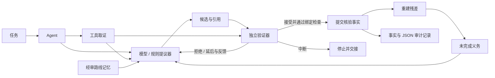

# ResiMind

**让模型提议，让验证器决定，让残差驱动下一步。**

面向**数学、工程和其他结构化任务的轻量神经符号 Agent 架构**。模型提出步骤，领域验证器检查证明证书与物理方程，残差持续记录尚未完成的义务。

**Python 3.10+ · 零运行时依赖 · MIT · 实验版本 v0.4.0**

[English](README.md) · [约束优化证明案例](docs/constrained-optimization.md) · [连续梁桥案例](docs/continuous-bridge.md) · [神经符号实现](docs/neuro-symbolic.md) · [架构](docs/architecture.md)

## 数学：算出一个解，还得证明它是全局最优

三变量二次优化，包含交叉项、等式约束、非负约束与上界：

$$
\min_x\;2x_1^2+x_1x_2+x_2^2+x_3^2-8x_1-3x_2-3x_3,
\quad x_1+x_2+x_3=3,\quad x\geq0,\quad x_1\leq1.
$$


第一次提议是只考虑等式约束的驻点 **(26/15, 1/5, 16/15)**。虽然目标函数值更低，却违反 `x1 <= 1`，因此被拒绝。读取反馈后，Agent 提出 **(1, 3/4, 5/4)**，目标值为 **−73/8**。

得到这个数值还不能结束任务。验证器依次检查精确的 **LDLᵀ 正定性、原始可行性、KKT 驻点与互补条件，以及多项式形式的全局最优性证书**。运算使用有理数；离线提议器枚举活跃约束，验证器检查提交的证书，不调用这套搜索过程。

```bash
python -m examples.constrained_optimization
python -m examples.constrained_optimization --json
```

```text
ACCEPT certify_convexity   → positive_definiteness_verified   (2 remaining)
REJECT certify_primal_dual → primal_inequality_violation      (2 remaining)
ACCEPT certify_primal_dual → primal_and_kkt_verified          (1 remaining)
ACCEPT certify_global     → global_gap_identity_verified     (0 remaining)
```

[查看完整问题、证明与拒绝案例 →](docs/constrained-optimization.md)

## 桥梁：满足平衡，还不一定满足连续条件

一座合成的 **24 m + 30 m 两跨连续梁桥**，两跨抗弯刚度不同。考虑恒载、左跨/右跨/双跨活载布置，以及两组给定的荷载组合，共 **八个工况**。


第一次提议把两跨当成独立简支梁。这样的结果可能满足力的平衡，却无法满足中墩两侧的转角连续。验证器检查梁方程和位移协调条件，拒绝错误方案，再核验修正后的连续梁解。

随后，Agent 必须覆盖所有要求的工况，计算支座反力、跨内正弯矩与中墩负弯矩、形成工况包络，再比较给定的弯矩与**跨中挠度**限值。漏掉布载工况，残差就不会清空；完成核验后发现超限，也会如实保留这个结论。

```bash
python -m examples.continuous_bridge
python -m examples.continuous_bridge --json
```

| 结果 | 数值 | 控制布载 |
| --- | ---: | --- |
| 中墩负弯矩 | −7,281.94 kN·m | 双跨加载 |
| AB 跨最大正弯矩 | +3,403.57 kN·m | 仅左跨活载 |
| BC 跨最大正弯矩 | +6,241.85 kN·m | 仅右跨活载 |

[查看结构模型、方程和适用范围 →](docs/continuous-bridge.md)

> 两个案例的校验真实执行，默认使用确定性的离线提议器，并故意设置错误候选来展示纠错。接入模型回调后可使用神经模型生成候选；示例没有宣称大模型准确率。桥梁案例是采用给定限值的合成线梁分析，不是规范设计鉴定；跨中挠度检查也不等于全桥最大挠度包络。

## 跑起来

```bash
git clone https://github.com/1105216375-alt/resimind.git
cd resimind
python -m venv .venv
source .venv/bin/activate
python -m pip install .
python -m examples.constrained_optimization
python -m examples.continuous_bridge
```

Windows PowerShell 使用 `.venv\Scripts\Activate.ps1` 激活环境。示例离线运行，不需要 API Key；安装时可能需要下载构建工具。

两个案例都返回同一种 `AgentResult`，可以查看证据、决策、事实与未完成义务：

```python
from resimind.domains.optimization import run_demo as optimize
from resimind.domains.bridge import run_demo as analyze_bridge

for result in (optimize(), analyze_bridge()):
    print(result.run_result.status)
    print(result.to_json())
```

| 适配器 | 独立检查 | 完成条件 |
| --- | --- | --- |
| [约束优化](src/resimind/domains/optimization.py) | 精确分解、可行性、KKT、多项式证书 | 全局最优性证书核验完成 |
| [连续梁桥](src/resimind/domains/bridge.py) | 平衡、曲率与协调条件、全部工况、弯矩极值 | 工况包络与给定限值比较完整 |
| [一元方程](src/resimind/domains/mathematics.py) | 有理数归一化、求解与回代 | 原方程检查完成，包括无解/恒等情况 |
| [轴向杆](src/resimind/domains/engineering.py) | 已声明前提、量纲、名义应力和给定限值 | 应力与比较结果核验完成 |

`solved` 表示声明的验证义务已经完成，不自动代表存在可行解或工程限值满足。每个适配器都有明确范围，共享核心负责把验证过程和未完成项暴露出来。

## 这里的神经符号，具体在哪里

**神经提议层。** `ModelProposer` 接受与服务商无关的 `complete(prompt: str) -> str` 回调。真实模型可以选择注册动作，提出带证据引用的候选。领域构建器支持 `build_agent(problem, complete=your_complete)`；回调接收当前状态、未完成义务、证据、允许动作以及上一步验证反馈，返回 JSON 候选或 `null`。

**符号验证层。** 可信的领域代码检查引用、前提、作用域、精确有理数与单位，并独立复算结果。允许提交的事实由验证器产生；模型的置信度或自报 `verified` 字段不能赋予自己验证权限。

**残差反馈层。** 残差是仍未完成的目标、未知项和硬约束集合，根据正式事实重建。候选被拒绝时保留原状态，将真实拒绝原因反馈给提议器；缺少条件时保留未完成义务。

因此，这是**可注入神经模型的神经符号架构**。仓库不带训练好的权重、神经训练流程或外部模型性能测评，也不是通用定理证明器。详见[实现位置与边界](docs/neuro-symbolic.md)。

## Agent 架构



- **先取证，再提议：** 注册工具为每个任务采集类型化输入。
- **先验证，再改状态：** 验证结果绑定候选、状态和证据；原子提交时检查引用与冲突。
- **未完成项可见：** 目标、未知项和硬约束一直保留，直到领域适配器确认义务解除。
- **路线可复用：** 内存中的路线经过审核且适用条件匹配后才能检索，复用步骤仍需以当前输入重新核验。
- **过程可检查：** 每次尝试都记录决策、原因、状态与残差；尝试次数和停滞预算限制执行循环。

## 接入自己的领域

实现三个接口：

| 接口 | 接入方负责什么 |
| --- | --- |
| `Proposer.propose(...)` | 用模型、规则或检索提出下一步候选 |
| `Verifier.verify(...)` | 独立检查当前输入和候选，返回接受、拒绝、延后或中断 |
| `Domain.rebuild(...)` | 根据正式事实重建全部未完成义务 |

通过 `Agent`、`Task`、注册的 `EvidenceTool` 和可选的 `RouteMemory` 装配。核心模块不导入数学或工程适配器。可沿用[适配器指南](docs/adapters.md)和[领域契约](docs/domain-contract.md)，接入自己的计算、仿真、规则检查或证明工具。

## 更多示例与测试

```bash
python -m examples.agent_demo       # 任务 → 工具 → 模型回调 → 验证
python -m examples.inventory        # 独立复算与拒绝错误候选
python -m examples.document_review  # 缺资料时保留未完成项
python -m examples.route_memory     # 审核、适用条件与撤销
python -m pip install -e '.[dev]'
python -m pytest -q
```

[验证记录](docs/validation.md)说明本地检查与范围；没有声称外部模型性能或生产环境可靠性。

## 当前范围

ResiMind 是实验阶段的同步 Agent 框架，工具在**循环之前**取证。尚未包含循环内动态工具调度、自动多角色规划、模型服务商 SDK、CAS/SMT/证明器现成连接器、学习式记忆、持久化或分布式执行。

领域验证器与残差重建器属于可信应用代码，它们的正确性决定 `solved` 的含义。证据标签不能认证现实输入的真实性，摘要绑定不能隔离恶意插件。调用方须设置模型、工具超时和资源限制；步骤预算无法打断阻塞回调，没有强制 token 或费用上限。

本仓库从「桥梁医生」的实践中提炼通用实现，只包含合成示例，不包含原应用业务档案、客户数据、凭据或私有模型日志。参见[来源与范围](docs/provenance.md)、[架构与信任边界](docs/architecture.md)和[安全说明](SECURITY.md)。

欢迎新的领域适配器、反例与验证失败测试，见 [CONTRIBUTING.md](CONTRIBUTING.md)。采用 [MIT License](LICENSE)。
