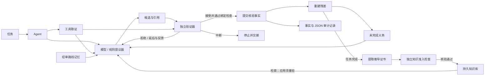

# ResiMind：会纠错、能积累知识的 AI Agent

**发现错步，换条路走。验证过的解法，留给下一题。**

ResiMind 是一套独立运行的开源**神经符号 Agent 架构**，把验证驱动的自我纠错和可复用规则记忆接进推理循环。沿用你的模型，由模型提出步骤，独立代码核验；**残差**记录还差什么，指导下一次尝试。

**自我纠错 × 可验证记忆 × 无需重训的知识增长**

当前[自适应数学 Agent](docs/adaptive-reasoning.md)会在验证失败后切换策略，还能把完成并验证过的推导变成后续任务可用的规则。这里的**可验证记忆**是持久化规则库：入库前验证、重载时复核、每次应用再验。知识积累在模型之外，模型权重保持不变。

当前自适应推理与规则学习示例支持**有界有理多项式展开**。同一套 Agent 核心还提供规划、客服、约束优化与桥梁示例，各自使用明确的检查条件。

**沿用你的模型 · Python 3.10+ · 核心零依赖 · MIT · v0.8.0 / 实验阶段**

[English](README.md) · [快速上手](#三分钟跑起来) · [知识增长](docs/knowledge-growth.zh-CN.md) · [开放性完整案例](#开放式规划答案可以多样约束必须满足) · [量化证据](#衡量-agent-架构带来了什么) · [架构](#agent-架构)

**项目发起者与原始发布者：[@1105216375-alt](https://github.com/1105216375-alt)。** [原始仓库](https://github.com/1105216375-alt/resimind) · [引用信息](CITATION.cff)

## 这一题会换解法，下一题能用上积累

| 能力 | 实际发生什么 |
| --- | --- |
| **自我纠错** | 验证失败后，可以拆局部任务、调用已验证规则、执行符号变换，或回到已验证检查点。 |
| **可验证记忆** | 完成的证明可以成为带条件和来源的持久化规则，入库与重载分别核验。 |
| **无需重训的学习** | 新题检索并执行规则，每次应用再次验证；模型权重保持不变。 |

每个新候选都要通过检查才能成为事实；换策略不会重置重试次数和行动预算。

```text
提议 → 检查 → 诊断剩余问题 → 切换策略 → 再次检查
                                        ↓
                          完成证明 → 验证入库 → 下一题复用并重验
```

离线恢复示例会故意提出一个错误展开式：错误被拒绝，局部修改通过，符号步骤完成证明；验证入库的规则随后用一次应用完成新变量的任务。模型响应由脚本提供，验证、状态变化、规则准入与复用都真实执行。

**当前范围：**自适应适配器支持有界有理多项式展开。其他领域共用 Agent 核心，使用各自的检查条件。Lean 接入留到后续版本。

[**运行自适应 Agent →**](docs/adaptive-reasoning.md) · [版本验证](docs/validation-v0.8.0.md) · [更新记录](CHANGELOG.md)

## 三分钟跑起来

准备好 Python，然后执行：

```bash
git clone https://github.com/1105216375-alt/resimind.git
cd resimind
python -m venv .venv
source .venv/bin/activate
python -m pip install .
python -m resimind demo --domain adaptive
```

Windows PowerShell 的激活命令为 `.venv\Scripts\Activate.ps1`。安装时可能需要下载构建工具。示例**离线运行，无需 API 密钥**；安装后，`python -m resimind` 与 `resimind` 命令均可在仓库目录外使用。

首个示例会展示错误展开被拒绝、局部修改通过、符号步骤完成证明，以及新规则保存重载后用于新变量的任务。终端会明确标注离线脚本，并列出策略审计记录。

选一个你关心的场景，下面六条命令都能离线运行：

| 场景 | 能看出什么 | 运行命令 |
| --- | --- | --- |
| [自适应推理](docs/adaptive-reasoning.md) | 拒绝错误步骤、切换解法、完成证明，再复用已验证规则 | `python -m resimind demo --domain adaptive` |
| [知识增长](docs/knowledge-growth.zh-CN.md) | 推导出规则，验证入库，下一题检索复用并重验 | `python -m resimind demo --domain knowledge-growth` |
| [开放式规划](docs/open-planning.md) | 答案可以多样，预算、时间和路线必须满足约束 | `python -m resimind demo --domain planning` |
| [日常客服](docs/customer-support.md) | 提议退 259 元，配置规则只允许计算出 249 元，金额被拦下 | `python -m resimind demo --domain customer-support` |
| [数学证明](docs/constrained-optimization.md) | 目标函数更低也可能不可行；最后检查精确最优性证书 | `python -m resimind demo` |
| [桥梁工程](docs/continuous-bridge.md) | 力的平衡过了，中墩两侧的转角仍可能对不上 | `python -m resimind demo --domain bridge` |

追加 `--json` 查看审计记录；[接入 DeepSeek](docs/open-planning.md#let-deepseek-choose-the-plan)，让模型自行组合行程。

## 推导一次，验明入库，下一题接着用

Agent 从基础步骤推导平方、立方恒等式，提交完整推导链，经独立核验后写入规则库。保存、重载时再次检查；新题检索到规则后，还要验证这次应用是否成立。

| 10 道迁移题的离线对比 | 固定知识库 | 增长知识库 |
| --- | ---: | ---: |
| 经独立评分确认完成 | 10/10 | 10/10 |
| 迁移阶段提案次数 | 84 | **24** |
| 实际提交的跨题规则应用 | 0 | **8** |

**迁移提案减少 71.4%**，学习规则另外花费 **13 次提案**。两组使用同一确定性提议器和相同预算，测到的是公开开发题上的复用收益；这组数字不等于模型准确率提升或总计算量节省。

[**查看证明、准入、存储、撤销与复用的完整机制 →**](docs/knowledge-growth.zh-CN.md) · [复现对比](benchmarks/knowledge_growth.py) · [验证记录](docs/validation-knowledge-growth.md)

## 已公开的早期试验：同一个 DeepSeek，四种 Agent 策略

下面的 v1/v2 记录对应早期实现，不是 v0.8 自适应适配器的成绩。

首轮冻结试验（v1）固定 **`deepseek-flash`**、模型参数和**每题最多 8 次调用**，运行预先冻结的 8 道代数题，由独立精确评分器核对最终答案。

| Agent 策略 | 正确完成 | 错误答案交付 | 迁移阶段模型调用 |
| --- | ---: | ---: | ---: |
| 自建 ReAct 式基线 | 5/8 | 3 | 8 |
| 验证后重试 | 6/8 | 0 | 22 |
| 残差推理 | 6/8 | 0 | 22 |
| **残差 + 已验证知识增长** | **7/8** | **0** | **20** |

增长组记录到 **3 次实际跨题规则应用**，都发生在其他组也完成的题上；多完成的那一题没有实际提交规则应用，因此不能把 7/8 因果归于规则复用。学习三条规则另需 **3 次调用**，学习加迁移合计 **23 次**；本次结果不支持总成本更低的结论。

这是单次、人工构造的小样本试验。ReAct 式基线提供了可选检查工具，但模型没有调用；比较对象是协议中的四种具体实现，不能据此给优化过的 ReAct 系统或整个领域排名。

**早期开发重跑：增强反馈，重测同一组旧题。** 分析 v1 后，我们增加了精确系数差异反馈，再次运行这 8 道已见题：

| Agent 策略 | 开发重跑 v2 正确完成 | 迁移调用 |
| --- | ---: | ---: |
| 自建 ReAct 式基线 | 5/8 | 8 |
| 验证后重试 | **7/8** | **17** |
| 残差推理 | 6/8 | 22 |
| 残差 + 已验证知识增长 | **7/8** | 20 |

三种强制验证组本次仍无错误交付。增长组另有 3 次学习调用，实际跨题规则应用仍为 3 次：**完成数与验证后重试持平，调用更多**。本次反馈改进没有提高残差组或增长组的完成数。这是看过结果后的旧题开发重跑，不是新的盲测；原始 v1 完整保留。

[**查看协议、逐题结果、token 与适用范围 →**](docs/algebra-live-evaluation.zh-CN.md) · [冻结 v1 摘要](docs/evidence/algebra-live-v1/summary.json) · [开发 v2 摘要](docs/evidence/algebra-feedback-v2/summary.json)

## 开放式规划：答案可以多样，约束必须满足

**原始需求：**“帮我安排轻松的一天，想看艺术、吃顿饭，偏好安静和咖啡。”

给定硬约束是：**09:00–18:00、单人预算 300 元、步行不超过 45 分钟、至少三个不同场所、覆盖艺术和用餐、最后返回起点车站**。还要满足开放时间、最短停留时长与每一段交通衔接。“安静”和“咖啡”最初属于偏好；后面的真实实验会把咖啡改成必选。

### 同一个需求，可以有不同的可行方案

模型可以选择去哪、什么顺序、几点去、怎么走。验证器检查整个方案是否满足约束，不拿它和唯一标准答案比较。下面两份离线方案都经过独立核验，满足同一组原始要求：

| 可行方案 | 总费用 | 步行 | 返回时间 |
| --- | ---: | ---: | --- |
| 画廊 → 面馆 → 阅览室 | 61 元 | 22 分钟 | 13:38 |
| 咖啡馆 → 陶艺工坊 → 阅览室 | 95 元 | 8 分钟 | 13:43 |

场所与交通是合成数据，核验的是给定条件下的可行性；“好不好玩”和“哪个最好”仍属于主观评价。[查看具体停留时间与交通选择](docs/open-planning.md#try-the-three-scenarios)。

### 方案碰到约束，反馈如何推动下一步


| 离线场景 | 实际处理过程 |
| --- | --- |
| 步行太多 | **50 分钟 > 45 分钟**，拒绝且正式事实不变；调整交通后降到 **22 分钟**，方案通过。 |
| 下雨，要求室内活动 | 花园不满足条件，被拒绝；改成室内场所后通过。 |
| 缺少返程交通数据 | 保留待补证据，不输出已核验行程。 |

这些是实际运行的**离线示例**，错误候选为有意构造；验证与状态变化真实执行，不把这些错误算到真实模型头上。

**这里能看到神经符号如何协作：**模型探索不同组合，符号验证守住明确条件，残差反馈指出仍需修正或补证据的地方。

### 需求变了，Agent 真能把方案改对吗？

一次真实 DeepSeek 调用生成了 **画廊 → 面馆 → 阅览室**，满足当时的条件。随后，我们在结构化需求中把**喝咖啡改成必选**，将这份真实旧方案重新交给 Agent：

| 步骤 | 实际发生了什么 |
| --- | --- |
| 重检旧方案 | **拒绝：**缺少必选活动，不提交任何事实。 |
| 把反馈交给 DeepSeek | **新增 1 次模型调用**，重新组合成画廊 → 阅览室 → 咖啡馆。 |
| 独立核验新方案 | **通过：**73 元、步行 35 分钟、13:04 返回，满足全部给定硬约束。 |

模型负责在多种方案中做选择，验证器负责守住要求。示例资料中的咖啡馆同时提供餐食与咖啡；场所与交通为合成数据，核验的是这些输入条件下的可行性。

[**查看两份提议、拒绝原因和核验结果 →**](docs/evidence/open-planning/README.md)

[**完整规则与三个离线场景**](docs/open-planning.md) · [**可运行源码**](examples/open_planning.py) · [**真实 DeepSeek 审计记录**](docs/evidence/open-planning/README.md)

## 直接运行独立 Agent

ResiMind 自己完成取证、提议、验证、提交事实与重建残差的推理循环，可以直接调用：

```python
from resimind import Task
from resimind.domains.planning import DOMAIN, build_agent, demo_problem, verified_plan

agent = build_agent(demo_problem())  # 离线演示；传入 complete=your_model 可使用神经模型。
result = agent.run(Task("day-out", "Plan a relaxed day with art and a meal.", DOMAIN))
run = result.run_result
if run.status == "solved" and run.residual.solved:
    print(verified_plan(result))
else:
    print("仍未解决：", run.residual.pending)
```

模型 SDK 与外部工作流连接器均属于[可选集成](#可选集成)。独立 Agent 和内置领域演示不需要安装 LangGraph。

## 日常客服：先核实退款条件，再给处理建议

客户申请退货，订单记录显示商品实付 **249 元**、运费 **10 元**。按示例商家配置的规则，这次退款报价不含运费。

| 情况 | Agent 的处理 |
| --- | --- |
| 候选说“可退 **259 元**” | 金额被拒绝，错误提议不会写入正式事实。 |
| 修正为“可退 **249 元**” | 核验申请条件和金额后，输出结构化处理建议。 |
| 缺少签收日期 | 保留待补证据，不能给出完整退款建议。 |
| 超过配置的申请期限 | 建议人工复核，不能自行编造政策例外。 |

```bash
python -m resimind demo --domain customer-support
python -m resimind demo --domain customer-support --scenario missing-delivery
python -m resimind demo --domain customer-support --scenario expired
```

这些命令使用合成订单和虚构商家规则，默认离线运行。Agent 给出处理建议，不执行退款，也不会声称款项已到账。缺证据场景会返回非零退出码，表示任务还没解决；也支持接入真实 DeepSeek 回调。

[查看客服规则、完整案例与真实模型接入 →](docs/customer-support.md) · [真实 DeepSeek 记录：5 次调用、2 次拒绝、核验后给出建议](docs/evidence/customer-support/README.md)

## 数学：算出一个解，还得证明它是全局最优


[静态轨迹图](docs/assets/verification-demo.png)。这是实际执行的离线示例，不可行候选为有意构造。

三变量二次优化，包含交叉项、等式约束、非负约束与上界：

$$
\min_x\;2x_1^2+x_1x_2+x_2^2+x_3^2-8x_1-3x_2-3x_3,
\quad x_1+x_2+x_3=3,\quad x\geq0,\quad x_1\leq1.
$$


第一次提议是只考虑等式约束的驻点 **(26/15, 1/5, 16/15)**。虽然目标函数值更低，却违反 `x1 <= 1`，因此被拒绝。读取反馈后，Agent 提出 **(1, 3/4, 5/4)**，目标值为 **−73/8**。

得到这个数值还不能结束任务。验证器依次检查精确的 **LDLᵀ 正定性、原始可行性、KKT 驻点与互补条件，以及多项式形式的全局最优性证书**。运算使用有理数；离线提议器枚举活跃约束，验证器检查提交的证书，不调用这套搜索过程。

```bash
python -m examples.constrained_optimization
python -m examples.constrained_optimization --json
```

```text
ACCEPT certify_convexity   → positive_definiteness_verified   (2 remaining)
REJECT certify_primal_dual → primal_inequality_violation      (2 remaining)
ACCEPT certify_primal_dual → primal_and_kkt_verified          (1 remaining)
ACCEPT certify_global     → global_gap_identity_verified     (0 remaining)
```

[查看完整问题、证明与拒绝案例 →](docs/constrained-optimization.md)

## 桥梁：满足平衡，还不一定满足连续条件

一座合成的 **24 m + 30 m 两跨连续梁桥**，两跨抗弯刚度不同。考虑恒载、左跨/右跨/双跨活载布置，以及两组给定的荷载组合，共 **八个工况**。


第一次提议把两跨当成独立简支梁。这样的结果可能满足力的平衡，却无法满足中墩两侧的转角连续。验证器检查梁方程和位移协调条件，拒绝错误方案，再核验修正后的连续梁解。

随后，Agent 必须覆盖所有要求的工况，计算支座反力、跨内正弯矩与中墩负弯矩、形成工况包络，再比较给定的弯矩与**跨中挠度**限值。漏掉布载工况，残差就不会清空；完成核验后发现超限，也会如实保留这个结论。

```bash
python -m examples.continuous_bridge
python -m examples.continuous_bridge --json
```

| 结果 | 数值 | 控制布载 |
| --- | ---: | --- |
| 中墩负弯矩 | −7,281.94 kN·m | 双跨加载 |
| AB 跨最大正弯矩 | +3,403.57 kN·m | 仅左跨活载 |
| BC 跨最大正弯矩 | +6,241.85 kN·m | 仅右跨活载 |

[查看结构模型、方程和适用范围 →](docs/continuous-bridge.md)

> 两个案例的校验真实执行，默认使用确定性的离线提议器，并故意设置错误候选来展示纠错。接入模型回调后可使用神经模型生成候选；示例没有宣称大模型准确率。桥梁案例是采用给定限值的合成线梁分析，不是规范设计鉴定；跨中挠度检查也不等于全桥最大挠度包络。

## 内置领域适配器

| 适配器 | 独立检查 | 完成条件 |
| --- | --- | --- |
| [知识增长](src/resimind/domains/polynomial_learning.py) | 精确多项式推导链、独立知识准入、重载与当前应用检查 | 完成原任务后才能提炼规则；未知检查不能晋升 |
| [开放式规划](src/resimind/domains/planning.py) | 预算、时间窗口、路线衔接、活动覆盖、步行与室内要求 | 有证据支持的可行行程；主观偏好不冒充已验证结论 |
| [售后客服](src/resimind/domains/customer_support.py) | 订单证据绑定、配置的业务规则、精确退款金额 | 核验后的处理建议或人工复核结论；缺证据时保持待办 |
| [约束优化](src/resimind/domains/optimization.py) | 精确分解、可行性、KKT、多项式证书 | 全局最优性证书核验完成 |
| [连续梁桥](src/resimind/domains/bridge.py) | 平衡、曲率与协调条件、全部工况、弯矩极值 | 工况包络与给定限值比较完整 |
| [一元方程](src/resimind/domains/mathematics.py) | 有理数归一化、求解与回代 | 原方程检查完成，包括无解/恒等情况 |
| [轴向杆](src/resimind/domains/engineering.py) | 已声明前提、量纲、名义应力和给定限值 | 应力与比较结果核验完成 |

`solved` 表示声明的验证义务已经完成，不自动代表存在可行解或工程限值满足。每个适配器都有明确范围，共享核心负责把验证过程和未完成项暴露出来。

## 这里的神经符号，具体在哪里

**神经提议层。** `ModelProposer` 接受与服务商无关的 `complete(prompt: str) -> str` 回调。真实模型可以选择注册动作，提出带证据引用的候选。领域构建器支持 `build_agent(problem, complete=your_complete)`；回调接收当前状态、未完成义务、证据、允许动作以及上一步验证反馈，返回 JSON 候选或 `null`。

**符号验证层。** 可信的领域代码检查引用、前提、作用域、精确有理数与单位，并独立复算结果。允许提交的事实由验证器产生；模型的置信度或自报 `verified` 字段不能赋予自己验证权限。

**残差反馈层。** 残差是仍未完成的目标、未知项和硬约束集合，根据正式事实重建。候选被拒绝时保留原状态，将真实拒绝原因反馈给提议器；缺少条件时保留未完成义务。

**知识增长层。** `LearningAgent` 从完成任务的推导中提炼候选知识，`KnowledgeLibrary` 调用领域验证器决定能否入库。库支持保存、重载重验与撤销；检索到的规则只能作为新候选的依据，不能绕过当前任务验证。

模型通过回调接入，项目贡献集中在 **Agent 的推理、验证与知识准入机制**。当前代数证明有明确的表达式与资源范围。详见[知识增长接口](docs/knowledge-growth.zh-CN.md)与[神经符号实现位置](docs/neuro-symbolic.md)。

## Agent 架构



- **先取证，再提议：** 注册工具为每个任务采集类型化输入。
- **先验证，再改状态：** 验证结果绑定候选、状态和证据；原子提交时检查引用与冲突。
- **未完成项可见：** 目标、未知项和硬约束一直保留，直到领域适配器确认义务解除。
- **知识可积累：** 完成的推导经过独立准入后写入规则库，保存重载时重验，新题应用时再验。
- **路线可复用：** 内存中的路线经过审核且适用条件匹配后才能检索，复用步骤仍需以当前输入重新核验。
- **过程可检查：** 每次尝试都记录决策、原因、状态与残差；尝试次数和停滞预算限制执行循环。

## 接入自己的领域

实现三个接口：

| 接口 | 接入方负责什么 |
| --- | --- |
| `Proposer.propose(...)` | 用模型、规则或检索提出下一步候选 |
| `Verifier.verify(...)` | 独立检查当前输入和候选，返回接受、拒绝、延后或中断 |
| `Domain.rebuild(...)` | 根据正式事实重建全部未完成义务 |

通过 `Agent`、`Task`、注册的 `EvidenceTool` 和可选的 `RouteMemory` 装配。核心模块不导入数学或工程适配器。可沿用[适配器指南](docs/adapters.md)和[领域契约](docs/domain-contract.md)，接入自己的计算、仿真、规则检查或证明工具。

## 可选集成

独立的 ResiMind Agent 负责提议、验证和残差反馈。按现有业务需要选择外部接入：

| 集成 | 用途 | 可选依赖 |
| --- | --- | --- |
| [DeepSeek](docs/live-model.md) | 向任意领域构建器提供真实神经模型提议。 | `.[deepseek]` |
| [OpenAI Responses](docs/live-model.md#optional-openai-responses-path) | 另一种模型回调。 | `.[openai]` |
| [LangGraph](docs/langgraph.md) | 从已有图工作流调用 ResiMind，按完成或未决状态分流。 | `.[langgraph]` |

从仓库目录运行真实规划：

```bash
python -m pip install '.[deepseek]'
# 先在本机环境中设置 DEEPSEEK_API_KEY 和 DEEPSEEK_MODEL。
python -m examples.open_planning --live --json
```

真实调用可能产生费用，也可能无法完成任务。调用次数与超时说明见模型接入文档；请求失败时不会换成离线答案。[验证记录](docs/validation.md)区分实际联网记录与模拟传输测试。

**LangGraph 是可选的外围连接器。** ResiMind 核心及全部领域适配器均可独立运行。已有 LangGraph 项目时，可使用[验证子图](docs/langgraph.md)取得已核验事实或未决义务；连接器本身不增加领域验证规则。

## 更多示例与测试

```bash
python -m examples.agent_demo       # 任务 → 工具 → 模型回调 → 验证
python -m examples.inventory        # 独立复算与拒绝错误候选
python -m examples.document_review  # 缺资料时保留未完成项
python -m examples.route_memory     # 审核、适用条件与撤销
python -m pip install -e '.[dev]'
python -m pytest -q
```

当前检查见 [v0.8.0 版本验证](docs/validation-v0.8.0.md)；历史检查保留在[知识增长开发记录](docs/validation-knowledge-growth.md)与[早期版本记录](docs/validation.md)中。

## 衡量 Agent 架构带来了什么

沿用相同模型，固定任务与资源上限，观察完成率、错误交付、调用成本和跨题复用。各实验的任务、数据与预算不同，结果分别报告：

| 实验 | 已测到什么 | 记录 |
| --- | --- | --- |
| 同模型代数：冻结 v1 与旧题开发 v2 | v1：5/8、6/8、6/8、7/8；v2：5/8、7/8、6/8、7/8，增长组与重试持平且调用更多 | [四组协议与结果](docs/algebra-live-evaluation.zh-CN.md) |
| 知识增长：10 道离线迁移题 | 两组均 10/10；提案 84→24，学习另计 13 次，实际跨题复用 8 次 | [方法与结果](docs/knowledge-growth.zh-CN.md) |
| ChinaTravel：12 道官方题，同一 DeepSeek | 官方 ReAct 0/12、官方 NeSy 5/12、ReAct + ResiMind 1/12；ResiMind 无错误交付，11 题未完成 | [完整评价](docs/chinatravel-evaluation.zh-CN.md) |
| 局部修复与有限搜索：旧任务回放 | 默认保守策略 0/2；加入明确人工语义标注后 1/2 | [开发结果](docs/search-development.zh-CN.md) |
| 开放式规划：真实需求变更 | 咖啡改为必选后旧方案被拒；1 次新增 DeepSeek 调用得到已核验新方案 | [提议与审计记录](docs/evidence/open-planning/README.md) |

[国内外系统对照](docs/public-systems-comparison.zh-CN.md)介绍 ResiMind 与编排框架、验证驱动推理及知识积累系统的关系。

## 当前范围

ResiMind 是实验阶段的同步 Agent 框架，工具在**循环之前**取证。已提供可选 DeepSeek／OpenAI 模型回调、LangGraph 验证子图、有限搜索，以及带独立准入和 JSON 持久化的知识库；有界代数适配器打通了推导到跨题复用的学习循环。尚未包含循环内动态工具调度、自动多角色规划、通用 CAS/SMT/证明器连接器或分布式执行。

领域验证器与残差重建器属于可信应用代码，它们的正确性决定 `solved` 的含义。证据标签不能认证现实输入的真实性，摘要绑定不能隔离恶意插件。调用方须设置模型、工具超时和资源限制；核心步骤预算无法打断阻塞回调。可选模型封装提供单次响应 token 与调用次数限制；它们不构成总费用或整个任务的硬时限。

本仓库从「桥梁医生」的实践中提炼通用实现，只包含合成示例，不包含原应用业务档案、客户数据、凭据或私有模型日志。参见[来源与范围](docs/provenance.md)、[架构与信任边界](docs/architecture.md)和[安全说明](SECURITY.md)。

## 作者与引用

ResiMind 由 [@1105216375-alt](https://github.com/1105216375-alt) 发起并首次发布，架构源自作者的「桥梁医生」应用。原始仓库为 [1105216375-alt/resimind](https://github.com/1105216375-alt/resimind)，[发布记录](https://github.com/1105216375-alt/resimind/releases)列出已公开的版本。提炼范围见[来源说明](docs/provenance.md)。

使用或介绍 ResiMind 时，欢迎注明项目来源并链接原始仓库。建议引用：

> 1105216375-alt. ResiMind（版本 0.8.0），2026. https://github.com/1105216375-alt/resimind

[CITATION.cff](CITATION.cff) 提供机器可读的引用信息。引用属于倡议，不是新增的许可条件。项目采用 [MIT License](LICENSE)，允许商用；软件副本或实质部分须保留版权和许可声明。

欢迎新的领域适配器、反例与验证失败测试，见 [CONTRIBUTING.md](CONTRIBUTING.md)。
