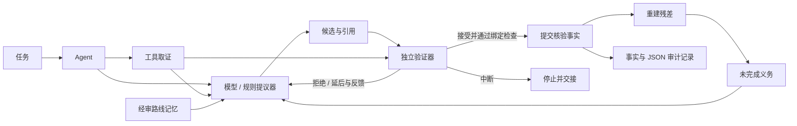

# ResiMind

**让模型提议，让验证器决定，让残差驱动下一步。**

面向**数学、工程和其他结构化任务的轻量神经符号 Agent 架构**。模型提出候选，领域规则独立核验；错误的原因与未完成的义务，成为下一步推理的输入。

**Python 3.10+ · 零运行时依赖 · MIT · 实验版本 v0.3.0**

[English](README.md) · [神经符号实现与边界](docs/neuro-symbolic.md) · [架构](docs/architecture.md) · [领域适配](docs/domain-contract.md) · [参与贡献](CONTRIBUTING.md)

## 先跑起来

克隆仓库并运行示例；已经下载仓库的，可以在仓库根目录跳过前两行：

```bash
git clone https://github.com/1105216375-alt/resimind.git
cd resimind
python -m venv .venv
source .venv/bin/activate
python -m pip install .
python -m examples.mathematics_agent
python -m examples.engineering_agent
```

Windows PowerShell 使用 `.venv\Scripts\Activate.ps1` 激活环境。示例离线运行，不需要 API Key；安装时可能需要下载构建工具。

数学示例求解 `(3/2)*x - 1/3 = 5/3`。用下面的代码查看真实的逐步决策：

```python
from resimind.domains.mathematics import run_demo

result = run_demo()
for event in result.run_result.trace:
    print(event.decision.value, event.candidate.claim, event.reasons[0])
```

```text
accept 3/2*x=2 normalization_verified
reject x=7/3 solution_claim_mismatch
accept x=4/3 solution_verified
accept substitution:5/3=5/3 original_equation_checked
```

错解不会进入正式事实，拒绝原因会回到下一轮提议。即使已经得到 `x=4/3`，回代检查没有完成，任务就不能收口。

工程示例由 **100 kN / 1,000 mm²** 算出 **100 MPa**：先拒绝故意设置的错误应力，再接受修正值，最后与输入的 **150 MPa** 限值比较。模型前提、数值和限值均为合成输入。

> 默认示例使用确定性的离线提议器，其中数学示例使用假的模型回调。验证、拒绝和反馈闭环真实执行，但它们不是大模型准确率的证据。注入自己的模型回调后，才会实际调用神经模型生成候选。

## 同一个 Agent，接入不同学科

```python
from resimind import Task
from resimind.domains.mathematics import LinearEquation, build_agent

agent = build_agent(LinearEquation("3/2", "-1/3", "5/3"))
result = agent.run(Task("equation-1", "求解并回代检查方程。", "mathematics"))
print(result.run_result.status)  # solved
print(result.to_json())         # 事实、证据、残差与每一次决策
```

工程适配器使用相同的任务与结果接口：

```python
from resimind import Task
from resimind.domains.engineering import AxialBarProblem, build_agent

agent = build_agent(AxialBarProblem(
    force_value=100, force_unit="kN",
    area_value=1000, area_unit="mm2",
    allowable_stress_value=150, allowable_stress_unit="MPa",
    axial_static=True, is_uniform=True, no_local_effects=True,
))
result = agent.run(Task("bar-1", "计算名义应力并比较给定限值。", "engineering"))
print(result.run_result.status)  # solved
print(result.to_json())
```

| 参考适配器 | 独立验证什么 | 什么条件下完成 |
| --- | --- | --- |
| [数学](src/resimind/domains/mathematics.py) | 精确有理数的归一化、求解、回代，以及无解和恒等情形 | 推导与原方程检查全部完成 |
| [工程](src/resimind/domains/engineering.py) | 对象与范围、已声明的模型前提、量纲、名义应力 `F/A` 和输入限值 | 应力与限值比较全部核验完成 |

`solved` 表示声明的验证义务已完成；核验结果可以是**“无解”**或**“超过给定限值”**。两个参考适配器各自覆盖明确的小范围问题，更广泛的数学和工程能力需要增加领域实现。

## 这里的神经符号，具体在哪里

**神经提议层。** `ModelProposer` 接受与服务商无关的 `complete(prompt: str) -> str` 回调。真实模型可以选择注册动作，提出带证据引用的候选。两个领域都支持 `build_agent(problem, complete=your_complete)`；回调接收当前状态、未完成义务、证据、允许动作以及上一步验证反馈，返回 JSON 候选或 `null`。

**符号验证层。** 可信的领域代码检查引用、前提、作用域、精确有理数与单位，并独立复算结果。允许提交的事实由验证器产生；模型的置信度或自报 `verified` 字段不能赋予自己验证权限。

**残差反馈层。** 残差是仍未完成的目标、未知项和硬约束集合，根据正式事实重建。候选被拒绝时保留原状态，将真实拒绝原因反馈给提议器；缺少条件时保留未完成义务。

因此，这是**可注入神经模型的神经符号架构**。仓库不带训练好的权重、神经训练流程或外部模型性能测评，也不是通用定理证明器。详见[实现位置与边界](docs/neuro-symbolic.md)。

## Agent 架构



- **先取证，再提议：** 注册工具为每个任务采集类型化输入。
- **先验证，再改状态：** 验证结果绑定候选、状态和证据；原子提交时检查引用与冲突。
- **未完成项可见：** 目标、未知项和硬约束一直保留，直到领域适配器确认义务解除。
- **路线可复用：** 内存中的路线经过审核且适用条件匹配后才能检索，复用步骤仍需以当前输入重新核验。
- **过程可检查：** 每次尝试都记录决策、原因、状态与残差；尝试次数和停滞预算限制执行循环。

## 接入自己的领域

实现三个接口：

| 接口 | 接入方负责什么 |
| --- | --- |
| `Proposer.propose(...)` | 用模型、规则或检索提出下一步候选 |
| `Verifier.verify(...)` | 独立检查当前输入和候选，返回接受、拒绝、延后或中断 |
| `Domain.rebuild(...)` | 根据正式事实重建全部未完成义务 |

通过 `Agent`、`Task`、注册的 `EvidenceTool` 和可选的 `RouteMemory` 装配。核心模块不导入数学或工程适配器。可沿用[适配器指南](docs/adapters.md)和[领域契约](docs/domain-contract.md)，接入自己的计算、仿真、规则检查或证明工具。

## 更多示例与测试

```bash
python -m examples.agent_demo       # 任务 → 工具 → 模型回调 → 验证
python -m examples.inventory        # 独立复算与拒绝错误候选
python -m examples.document_review  # 缺资料时保留未完成项
python -m examples.route_memory     # 审核、适用条件与撤销
python -m pip install -e '.[dev]'
python -m pytest -q
```

[验证记录](docs/validation.md)说明本地检查与范围；没有声称外部模型性能或生产环境可靠性。

## 当前范围

ResiMind 是实验阶段的同步 Agent 框架，工具在**循环之前**取证。尚未包含循环内动态工具调度、自动多角色规划、模型服务商 SDK、CAS/SMT/证明器现成连接器、学习式记忆、持久化或分布式执行。

领域验证器与残差重建器属于可信应用代码，它们的正确性决定 `solved` 的含义。证据标签不能认证现实输入的真实性，摘要绑定不能隔离恶意插件。调用方须设置模型、工具超时和资源限制；步骤预算无法打断阻塞回调，没有强制 token 或费用上限。

本仓库从「桥梁医生」的实践中提炼通用实现，只包含合成示例，不包含原应用业务档案、客户数据、凭据或私有模型日志。参见[来源与范围](docs/provenance.md)、[架构与信任边界](docs/architecture.md)和[安全说明](SECURITY.md)。

欢迎新的领域适配器、反例与验证失败测试，见 [CONTRIBUTING.md](CONTRIBUTING.md)。采用 [MIT License](LICENSE)。
