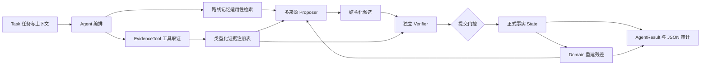

# Agent 架构与信任边界

这个框架把 Agent 的任务执行组织成六个层次。`Agent` 是任务入口，`Engine` 是内部执行循环。



## 1. 任务与工具层

`Task` 保存任务标识、指令、领域与上下文。接入方注册可信的 `EvidenceTool`，工具在任务开始时采集并返回 `Evidence`。每份证据包括 ID、对象、指标、值、单位、来源和适用范围。

工具返回的是输入材料。来源标签本身不证明真实性，Agent 也不会将工具结果直接升级为已验证结论。任何工具异常、非法返回或重复证据 ID 都会让任务失败关闭。首版的工具采集发生在循环前；循环中动态调度工具是后续扩展，不是已实现功能。

## 2. 提议层（神经 / 规则 / 检索）

`Proposer` 只提议下一步；`ModelProposer` 通过注入的文本生成函数调用任意模型，以严格 JSON 提出候选。动作必须来自接入方提供的注册名称，候选只含 `id/action/target/claim/refs`，不接受 `verified` 之类自授权字段。

`target` 必须对应仍未完成的义务；`refs` 必须指向注册证据或已有事实。Agent 工厂可以把经审路线和当前证据交给提议器。多个提议器按轮次轮换，每轮取第一个候选；其余候选不排队。提议器可实现 `observe(event)` 接收本轮真实决策；`ModelProposer` 将最近一次候选、决策与原因放进下一轮 prompt，使模型能据此纠错。观察器异常保留已提交状态并停止运行。首版没有自动 planner、角色辩论或自动切模型。

## 3. 独立验证层（符号 / 规则 / 可复算逻辑）

可信 `Verifier` 检查候选是否得到当前证据支持，输出 `Verdict`。它应独立复算数值、核对单位与对象、检查规则前提，不能只相信提议器提供的置信度、解释或“验证成功”。

| 决策 | 状态行为 |
| --- | --- |
| `accept` | 尝试提交验证器给出的事实，随后重建残差 |
| `reject` | 拒绝该候选，不更新状态 |
| `defer` | 信息不足或暂不能判断，不更新状态 |
| `interrupt` | 停止当前任务，保留已有状态和未决项 |

框架不内置所有领域的规则。符号验证可以是精确算术、结构化政策、数据库一致性检查，或外部证明工具；这些都由适配器实现。示例演示精确整数计算与明确集合规则，没有声称自然语言语义的完整证明。

## 4. 事务与残差层

`Verdict` 绑定候选摘要、状态版本及内容摘要、证据摘要。提交时重新计算并比对这些绑定，检查事实 ID、证据引用及同对象/指标/范围的冲突。提交值来自验证器返回的 `Fact`，不直接复制候选 claim。

`Domain.rebuild` 根据拟提交状态重新列出目标、未知项、硬约束。三类均为空才算完成。若重建抛错，保留旧状态；不会先提交事实再留下损坏残差。领域适配器本身属于可信代码，错误地返回空残差仍会导致错误完成。

残差不是神经网络里的 residual connection。这里的 `R_k` 是未完成义务集合，`S_k` 是已提交事实：

```text
C_k = proposer(S_k, R_k)
V_k = verifier(C_k, S_k, R_k, E)
S_(k+1) = commit(S_k, V_k)  only if accept and binding checks pass
R_(k+1) = domain.rebuild(S_(k+1))
```

进展指标是未完成义务总数严格减少。添加一个没有减少残差的新事实不会重置停滞预算。复杂领域可能需要允许多步准备或分解目标，因此应配置合适的 `max_no_progress`；首版没有可插拔进度函数。

## 5. 经审路线记忆

`RouteMemory` 保存动作名称、领域、上下文和必要指标。只有批准且所有适用条件满足的路线才能被检索。审核与撤销都记录原因，撤销终态；新版本使用新的路线 ID。

它不保存自动成立的事实，不会训练模型，也不代表学习式语义向量库。检索到路线后，当前证据仍经过普通验证流程。审核人名称是调用方提供的标签，不是身份认证系统。首版仅在内存保存记录，无并发控制或持久化。

## 6. 结果与运行边界

`AgentResult` 包括任务、工具事件、所选路线与 `RunResult`；后者包括状态、残差、停止原因及每次尝试的前后快照。默认交付结构化已验证事实和未完成义务，不使用自由生成文本替代结果。

预算约束尝试次数与连续无进展次数，包括空候选、拒绝与延后。同步回调阻塞时它无法强制中止，模型/网络工具须自行超时，必要时在进程外隔离。核心没有 token、调用费用和总墙钟时限保障。可选的 DeepSeek／OpenAI 封装限制 API 尝试次数与单次输出 token，并设置 SDK 网络超时；这些局部限制不等于整个任务的总费用或硬时限。

不可变数据与摘要约束防止意外修改和串用，不隔离恶意 Python 插件，也不认证恶意验证器。代码能校验引用存在，却不能自动确认现实世界中的输入真实。运行记录可能包含业务数据，调用方负责保管。
