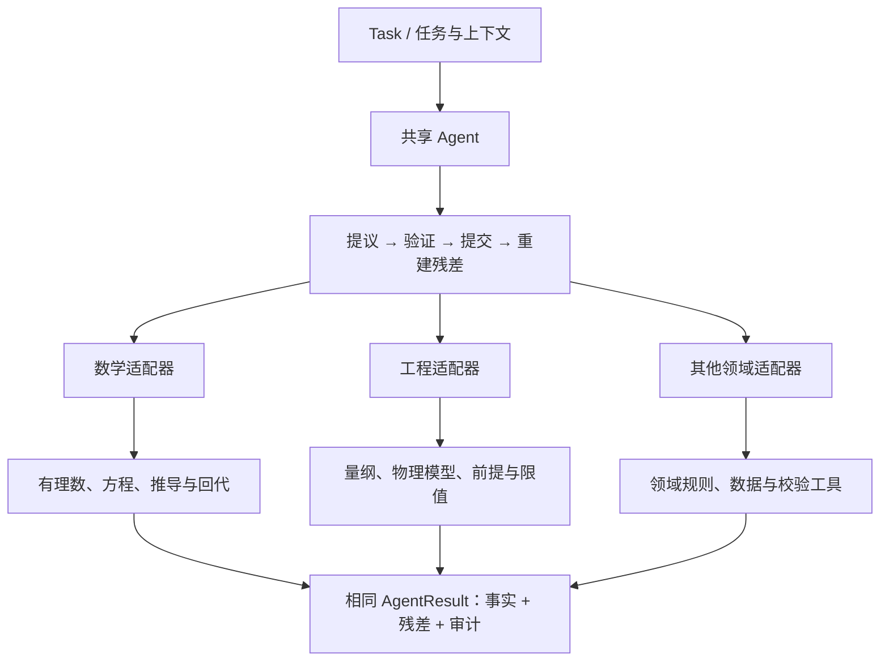

# 工程与数学共用的 Agent 架构

ResiMind 的通用性来自稳定的任务、证据、候选、验证和状态转移契约。工程模型与数学规则作为领域适配器接入同一个 `Agent`，无需改写执行循环。

## 共享什么，接入什么

| 架构层 | 共用契约 | 数学任务 | 工程任务 |
| --- | --- | --- | --- |
| 任务 | `Task` | 求解、验证推导或检查条件 | 核算、诊断或检查约束 |
| 输入 | `Evidence` | 题设、定义、已知条件 | 测量、几何、参数、模型前提 |
| 提议 | `Candidate` / `Proposer` | 下一步变形或候选解 | 下一步核算或候选结论 |
| 验证 | `Verifier` / `Verdict` | 精确代数、回代、适用条件 | 量纲、公式、边界条件、独立复算 |
| 正式状态 | `Fact` / `State` | 已核验的中间命题与结果 | 已核验的物理量与比较结果 |
| 残差 | `Residual` | 尚未证明、尚未检查的义务 | 缺失输入、未满足前提、未完成校核 |
| 记忆 | `RouteMemory` | 有适用前提的解题路线 | 有适用条件的分析路线 |
| 结果 | `AgentResult` | 结论与证明过程 | 分析结果与限制条件 |

`Agent` 本身不包含桥梁、库存、方程或杆件的判断分支。两个参考适配器放在可安装的 `resimind.domains` 包中，示例只负责调用它们；因此安装 wheel 后仍可以在自己的项目中复用。

## 已运行的两种领域

**数学：精确一元一次方程。** 给定 `a*x+b=c`，依次完成归一化、求解、回代或退化情形核验。使用标准库 `Fraction`，有理数计算不依赖浮点近似。错误解不能靠自称完成跳过回代。`a=0` 时区分无解与任意有理数均为解。

**工程：静态轴向杆名义应力。** 在明确的模型前提下，对力与面积做量纲检查，以 `F/A` 计算名义应力，再与输入的许用应力比较。单位工具将数值规范化为 SI 基准值，跨单位比较保持精确有理数。示例参数与限值都是合成输入。公式及均匀受力前提参见 [Illinois Mechanics Reference](https://mechref.engr.illinois.edu/sol/stress.html)，单位与前缀定义参见 [BIPM SI 手册](https://www.bipm.org/en/publications/si-brochure)。

这两种实现证明同一套 Agent 契约能容纳不同验证逻辑。数学适配器当前只覆盖所描述的线性方程；工程适配器只覆盖所描述的简化物理模型。更复杂的数学与工程能力需要对应适配器。

## “任务完成”与“结论为真”

`RunResult.status == "solved"` 表示该任务声明的验证义务已完成。它不表示任意用户猜想都成立，也不表示任何工程对象都满足限值。

- 数学任务可以完整地证明“该方程无解”。
- 工程任务可以完整地核验出“超过给定限值”。
- 如果缺少必需的模型前提、证据或校验，保留残差；不能只输出一个结果就算完成。

领域适配器必须明确哪些项目是分析前提，哪些是待计算的结论。把“算出不满足限值”错误地解释为 Agent 没有完成分析，会混淆业务结果与执行状态。

## 接入更复杂的领域

1. 定义题设、单位、对象、作用范围和结论的类型。
2. 将真实数据通过注册工具转换为 `Evidence`，保留来源。
3. 注册候选动作和规则前提；模型只选择或提出这些动作。
4. 在验证器中调用可信的代数、求解、仿真或规则检查工具，独立核验候选。
5. 根据已经提交的事实重建全部未完成义务，明确何时应拒绝、延后或中断。
6. 用错误结论、缺条件、错对象、错单位与数值边界测试验证器。

可以按这个契约接入 CAS、SMT、定理证明器、数值求解器或工程规则库。首版扩展不包含这些外部系统的现成连接器；它提供接口与两个完整参考适配器。工具响应也需要绑定到当前任务与输入，不能把“调用成功”视为“结论正确”。

工程领域遇到数据不确定性、经验模型与数值误差时，应显式增加误差界与适用范围验证。本版单位工具只覆盖乘法型质量—长度—时间量纲，不处理温度偏移、测量不确定度或完整 SI 单位语法。

单位工具对数字文本设置长度与科学计数指数上限，在构造有理数前拒绝超限文本。原生 `int`/`Fraction` 参数与插件代码仍属于可信应用输入，调用方负责限制计算资源。

## 仓库与发布边界

当前使用一个仓库和一个安装包，内部保持三个模块边界：

- 通用 Agent：任务、证据、候选、验证门控、残差、记忆与审计。
- 数学适配器：`resimind.domains.mathematics`，有自己的入口与测试。
- 工程适配器：`resimind.domains.engineering`，有自己的入口与测试，使用独立的 `units` 工具模块。

两个适配器依赖共用的 Agent 契约，核心模块不导入这两个适配器。目前它们没有第三方运行时依赖，统一版本便于核验兼容性。如果未来领域插件的依赖、维护团队或发布周期明显分化，可再拆成单独的安装包或仓库；不需要复制两套核心。
