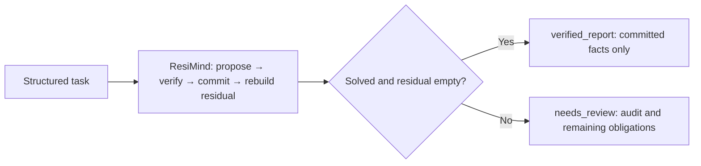

# Optional LangGraph connector

ResiMind has its own standalone Agent runtime. LangGraph is an optional outer
integration for applications that already use a graph workflow; it is not a
dependency of the reasoning core or any domain adapter. For a direct Agent
example, see [open-ended planning](open-planning.md).

Put ResiMind between candidate generation and the next step of your workflow.
The graph runs an existing ResiMind `Agent`, then routes to `verified_report`
only when its status is `solved` **and** its residual is empty. Every other
outcome goes to `needs_review`, with the outstanding obligations preserved.



This is a real compiled `StateGraph`, built with LangGraph's
[Graph API](https://docs.langchain.com/oss/python/langgraph/quickstart).
Both branches return locally. They do not publish a report, contact a reviewer,
or give a model permission to turn a rejected claim into a final answer.

## Run it without an API key

From the repository root:

```bash
python -m pip install -e ".[langgraph]"
python examples/langgraph_optimization.py
```

The default is explicitly **OFFLINE**. A deterministic active-set proposer
submits a valid convexity certificate, an invalid candidate, a corrected KKT
certificate, and an exact global-optimality certificate. The verifier checks
each proposal independently. Expected output includes:

```text
ResiMind + LangGraph | OFFLINE (deterministic, no model requests)
  ... ACCEPT certify_convexity ...
  ... REJECT certify_primal_dual: primal_inequality_violation ...
  ... ACCEPT certify_primal_dual ...
  ... ACCEPT certify_global ...
Graph branch: verified_report
Verified minimizer: x = ['1', '3/4', '5/4']; objective = -73/8
```

`--json` returns the mode, branch, fact report, and full audit. The audit includes
rejected proposals; it is separate from the completed fact report. Exit code
`0` means a completed report; `2` means unresolved or invalid CLI configuration.
The mathematical contract and its limits are documented in
[the optimization example](constrained-optimization.md).

## Run with a real model

Install both optional integrations, provide your own model name and API key in
the environment, and opt in to network requests explicitly:

```bash
python -m pip install -e ".[deepseek,langgraph]"
# Set DEEPSEEK_API_KEY and DEEPSEEK_MODEL in your environment first.
python examples/langgraph_optimization.py --live --provider deepseek --max-calls 8
```

For the deeper optimization example, this explicit configuration completed one
live smoke test with `deepseek-flash` in four model calls:

```bash
python examples/langgraph_optimization.py --live --model deepseek-flash --max-output-tokens 8192 --timeout 90
```

That is a single observed success, not a guarantee that another run or model
will finish. The same verifier and `needs_review` branch apply to every run.
`--max-output-tokens` defaults to `4096`; `--timeout` defaults to `60` seconds
and is the SDK network timeout, not a deadline for the complete workflow.

The DeepSeek integration uses the compatible OpenAI SDK installed by the
`deepseek` extra, while sending requests only to DeepSeek. To use OpenAI instead, set `OPENAI_API_KEY` and `OPENAI_MODEL`,
then run:

```bash
python examples/langgraph_optimization.py --live --provider openai --max-calls 8
```

`--model MODEL` overrides the selected provider's model environment variable.
The program labels the mode as `LIVE`, prints model-call and token-usage
accounting, and never silently falls back to the offline solver. Live JSON also
records the selected provider and model so the audit identifies the run. Missing
configuration fails before execution. API failures, malformed responses, and
unverified certificates cannot produce a completed report. A real model may
not solve the problem within the request budget; `needs_review` is a supported
outcome, not evidence that the problem is infeasible. Model requests can incur
provider charges.

## Use your own Agent or model callback

```python
from resimind import Task
from resimind.domains.optimization import DOMAIN, build_agent, demo_problem
from resimind.integrations.langgraph import build_verification_graph

agent = build_agent(demo_problem())  # Offline; use complete=my_callback for a model.
graph = build_verification_graph(agent)
state = graph.invoke({"task": Task("example", "Prove the global minimum.", DOMAIN)})

assert state["branch"] == "verified_report"
assert state["result"].run_result.residual.solved
print(state["report"])  # Only task_id and serialized committed facts.
```

An injected `complete(prompt: str) -> str` callback uses the same
[candidate contract](adapters.md) as the standalone Agent. The model only
proposes certificates. LangGraph supplies orchestration; the configured domain
verifier decides whether the proposal meets the task's proof obligations.

The output has four fields:

| Field | Meaning |
| --- | --- |
| `task` | The input `Task`. |
| `result` | Immutable `AgentResult`: committed state, residual, tool evidence, and full decision trace. |
| `branch` | `verified_report` or `needs_review`. |
| `report` | `{task_id, facts}` on completion; otherwise `None`. Facts are detached JSON-compatible dictionaries. |

Partial verified facts remain in `result.run_result.state.facts` when a run is
unfinished. They do not become a completed report. Read the corresponding
residual before deciding what further work is needed.

## Add the compiled graph to an existing workflow

The verification graph accepts only `task` as input and recomputes the result.
Use it as a subgraph and put downstream work behind the completion branch:

```python
from langgraph.graph import END, START, StateGraph
from resimind import Task
from resimind.domains.optimization import DOMAIN, build_agent, demo_problem
from resimind.integrations.langgraph import (
    VerificationInput, VerificationState, build_verification_graph,
)

class WorkflowState(VerificationState, total=False):
    consumed_fact_ids: list[str]

def consume_verified_report(state):
    return {"consumed_fact_ids": [fact["id"] for fact in state["report"]["facts"]]}

workflow = StateGraph(WorkflowState, input_schema=VerificationInput)
workflow.add_node("verify", build_verification_graph(build_agent(demo_problem())))
workflow.add_node("consume_verified_report", consume_verified_report)
workflow.add_edge(START, "verify")
workflow.add_conditional_edges("verify", lambda state: state["branch"], {
    "verified_report": "consume_verified_report",
    "needs_review": END,
})
workflow.add_edge("consume_verified_report", END)

output = workflow.compile().invoke({"task": Task("workflow", "Prove the minimum.", DOMAIN)})
print(output.get("consumed_fact_ids", []))
```

To see the blocked branch, use
`build_agent(demo_problem(), complete=lambda prompt: "null")`. No verified
report is produced, the downstream consumer is skipped, and all three proof
obligations remain in `output["result"].run_result.residual`.

This integration uses LangGraph 1.x and keeps the core package dependency-free.
It installs no checkpointer; each invocation starts a new Agent run. Callbacks
and tools supplied by the application may maintain their own sessions or
request budgets, so create a fresh provider wrapper for an independent budget.
Persistent checkpoint serialization, human approval UIs, asynchronous execution,
and automatic installation of verifiers for new domains are outside this
adapter's contract.
